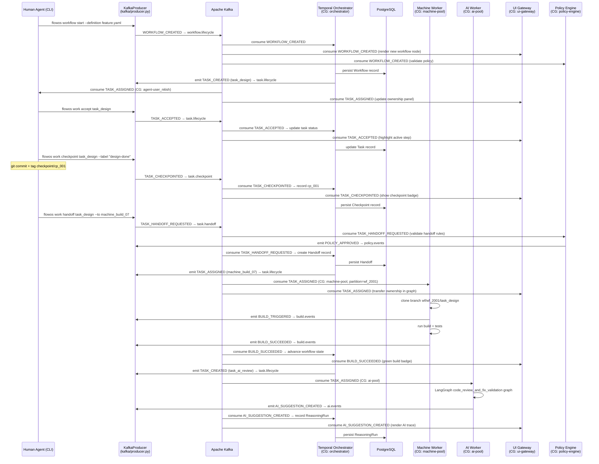
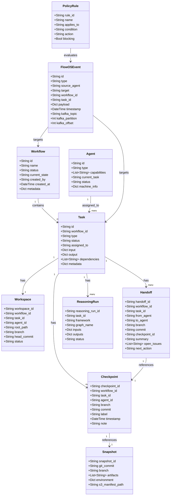
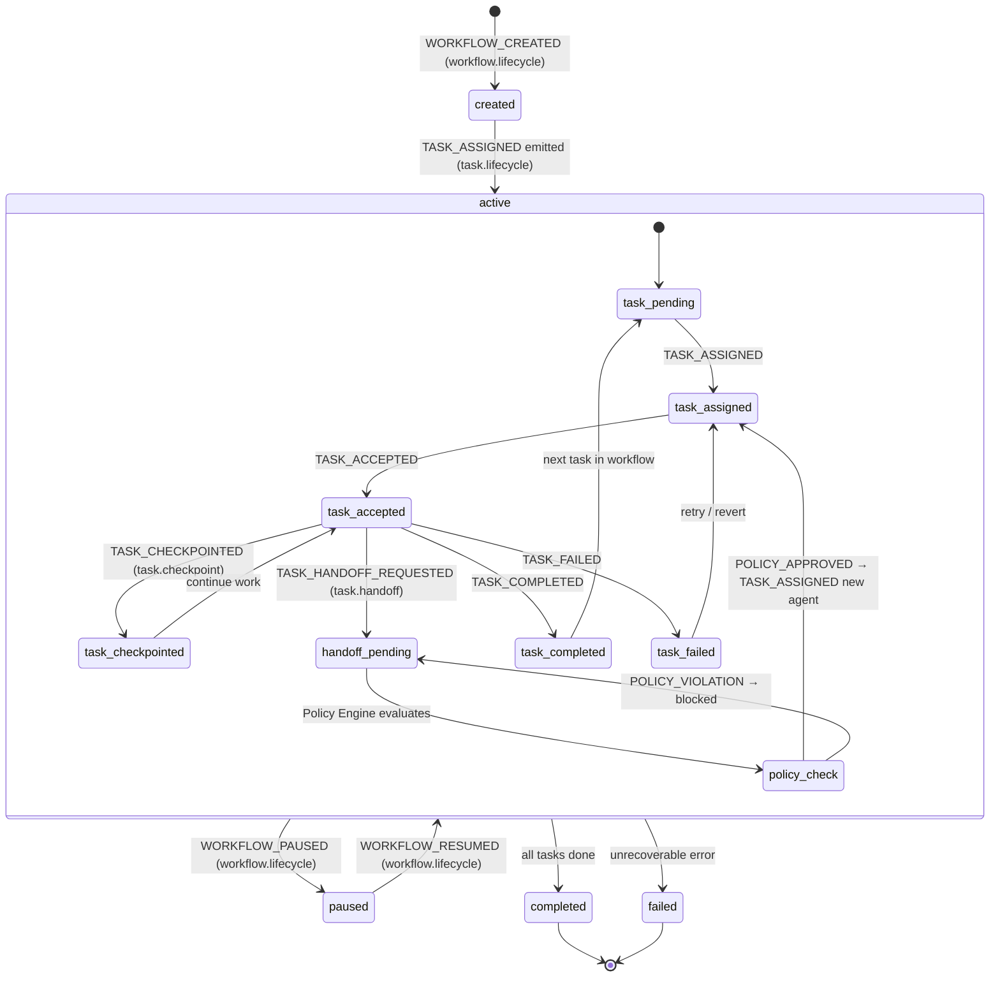

# FlowOS — Distributed Human + Machine Orchestration Platform: Full Implementation Plan

FlowOS is a durable, event-driven orchestration platform where humans, machines, and AI agents collaborate through stateful workflows. Every node maintains a local Git-backed reversible workspace, and AI reasoning frameworks (LangChain, LangGraph) plug in as modular execution layers — not as the system of record. This plan covers all three MVP phases: core foundation, execution + visibility, and intelligence + policy — implemented as a Python monorepo with Docker Compose for local development, using Apache Kafka as the collaboration backbone.

---

## Design & Architecture

### Overview

FlowOS separates concerns across four orthogonal planes: **durable orchestration** (Temporal), **local reversible workspace state** (Git per node), **AI reasoning** (LangGraph/LangChain inside task boundaries), and **remote compute execution** (Kubernetes + Argo). These planes communicate exclusively through an **Apache Kafka event bus**, ensuring no tight coupling between participants.

The system treats every participant — human, machine, or AI — as a first-class **Agent** with a CLI interface, a local workspace manager, and a Git-backed state boundary. Workflows are defined declaratively in YAML DSL, parsed by the orchestrator, and executed as Temporal workflows. Tasks are assigned to agents via Kafka events; agents accept, checkpoint, hand off, or complete tasks through the CLI. The orchestrator tracks workflow truth; nodes track local workspace truth.

**Kafka is the central nervous system of FlowOS.** Every meaningful action — task assignment, checkpoint creation, handoff, build result, AI suggestion — is expressed as a Kafka event on a well-defined topic. Participants are organized into consumer groups so that: (a) the Orchestrator always sees every event, (b) the correct agent receives its assignment, (c) the UI receives a real-time stream for visualization, and (d) the observability layer captures all events for metrics and replay. This fan-out model means no participant polls another — they all react to the shared event stream.

The UI layer provides real-time visibility into workflow graphs, agent ownership, event timelines, checkpoint history, and AI reasoning traces via a React + React Flow frontend connected to a WebSocket/SSE backend that tails Kafka topics. The policy engine enforces RBAC rules, branch protection, and approval gates. Observability is built in from the start with structured metrics and event streaming.

---

### Diagram 1: System Architecture — Component View

```mermaid
graph TD
    subgraph CLI["CLI Layer (Python)"]
        HCLI[Human CLI<br/>flowos work / workspace]
        MCLI[Machine CLI<br/>flowos run / workspace]
        ACLI[AI CLI<br/>flowos ai]
    end

    subgraph NodeLayer["Node Layer (per agent)"]
        WSM[WorkspaceManager<br/>workspace_manager.py]
        LGit[LocalGitOps<br/>git_ops.py]
        LMeta[LocalMetadata<br/>.flowos/state.json]
        EventBuf[KafkaProducer<br/>kafka/producer.py]
        EventCons[KafkaConsumer<br/>kafka/consumer.py]
    end

    subgraph KafkaBus["Apache Kafka — Event Bus"]
        direction TB
        T1[workflow.lifecycle<br/>WORKFLOW_CREATED/PAUSED/RESUMED/COMPLETED]
        T2[task.lifecycle<br/>TASK_CREATED/ASSIGNED/ACCEPTED/COMPLETED/FAILED]
        T3[task.checkpoint<br/>TASK_CHECKPOINTED/REVERT_REQUESTED]
        T4[task.handoff<br/>TASK_HANDOFF_REQUESTED/HANDOFF_ACCEPTED]
        T5[build.events<br/>BUILD_TRIGGERED/SUCCEEDED/FAILED]
        T6[ai.events<br/>AI_SUGGESTION_CREATED/REASONING_STARTED/COMPLETED]
        T7[policy.events<br/>POLICY_VIOLATION_DETECTED/APPROVAL_REQUESTED]
        T8[observability.events<br/>METRICS/AUDIT_LOG/REPLAY_EVENTS]
    end

    subgraph Orchestrator["Orchestrator Layer (Temporal)"]
        TWorker[Temporal Worker<br/>orchestrator/worker.py]
        WFDef[Workflow Definitions<br/>orchestrator/workflows/]
        Activities[Activities<br/>orchestrator/activities/]
        KConsOrch[Consumer Group: orchestrator<br/>subscribes: ALL topics]
    end

    subgraph ExecutionLayer["Execution Layer"]
        MachineWorker[Machine Worker<br/>workers/machine_worker.py]
        AIWorker[AI Worker<br/>workers/ai_worker.py]
        ArgoClient[Argo Client<br/>workers/argo_client.py]
    end

    subgraph AILayer["AI Reasoning Layer"]
        LGGraph[LangGraph Graphs<br/>ai/graphs/]
        LChain[LangChain Tools<br/>ai/tools/]
    end

    subgraph DataLayer["State & Metadata Layer"]
        Postgres[(PostgreSQL<br/>workflows, tasks, agents,<br/>checkpoints, handoffs)]
        S3[S3-compatible<br/>Artifact Storage]
        TemporalDB[(Temporal History)]
    end

    subgraph UILayer["UI Layer (React)"]
        ReactApp[React App<br/>ui/src/]
        WSServer[WebSocket Server<br/>api/ws_server.py]
        KConsUI[Consumer Group: ui-gateway<br/>subscribes: ALL topics]
    end

    subgraph PolicyLayer["Policy Engine"]
        PolicySvc[Policy Service<br/>policy/engine.py]
        KConsPol[Consumer Group: policy-engine<br/>subscribes: task.*, workflow.*]
    end

    HCLI --> WSM
    MCLI --> WSM
    ACLI --> WSM
    WSM --> LGit
    WSM --> LMeta
    WSM --> EventBuf
    EventCons --> WSM

    EventBuf --> T1
    EventBuf --> T2
    EventBuf --> T3
    EventBuf --> T4
    EventBuf --> T5
    EventBuf --> T6
    EventBuf --> T7

    KConsOrch --> TWorker
    TWorker --> WFDef
    WFDef --> Activities
    Activities --> EventBuf
    Activities --> Postgres

    T2 --> MachineWorker
    T2 --> AIWorker
    MachineWorker --> ArgoClient
    AIWorker --> LGGraph
    LGGraph --> LChain
    MachineWorker --> S3
    AIWorker --> S3

    KConsUI --> WSServer
    WSServer --> ReactApp

    KConsPol --> PolicySvc
    PolicySvc --> EventBuf

    Postgres --> WSServer
```



---

### Diagram 2: Kafka Collaboration Model — How All Participants Sync

This diagram is the answer to "how do various systems and users collaborate over Kafka and stay in sync."

```mermaid
graph TD
    subgraph Producers["Event Producers"]
        P1[Human CLI Agent<br/>kafka/producer.py → emit on task.lifecycle, task.checkpoint, task.handoff]
        P2[Machine Worker<br/>workers/machine_worker.py → emit on build.events, task.lifecycle]
        P3[AI Worker<br/>workers/ai_worker.py → emit on ai.events, task.lifecycle]
        P4[Temporal Activities<br/>orchestrator/activities/ → emit on workflow.lifecycle, task.lifecycle]
        P5[Policy Engine<br/>policy/engine.py → emit on policy.events]
    end

    subgraph Topics["Kafka Topics (Partitioned by workflow_id)"]
        T1[workflow.lifecycle]
        T2[task.lifecycle]
        T3[task.checkpoint]
        T4[task.handoff]
        T5[build.events]
        T6[ai.events]
        T7[policy.events]
        T8[observability.events]
    end

    subgraph ConsumerGroups["Consumer Groups — Who Reads What"]
        CG1["CG: orchestrator<br/>reads: ALL topics<br/>→ drives Temporal signals<br/>→ advances workflow state"]
        CG2["CG: agent-{agent_id}<br/>reads: task.lifecycle (filtered by assigned_to)<br/>→ CLI receives TASK_ASSIGNED<br/>→ triggers workspace init"]
        CG3["CG: ui-gateway<br/>reads: ALL topics<br/>→ WebSocket fan-out to browser<br/>→ real-time graph updates"]
        CG4["CG: policy-engine<br/>reads: task.lifecycle, workflow.lifecycle, task.handoff<br/>→ validates rules<br/>→ emits POLICY_VIOLATION or APPROVAL_REQUESTED"]
        CG5["CG: observability<br/>reads: ALL topics<br/>→ writes to metrics store<br/>→ audit log persistence"]
        CG6["CG: machine-pool<br/>reads: task.lifecycle (type=machine)<br/>→ machine workers pick up TASK_ASSIGNED<br/>→ compete via partition ownership"]
        CG7["CG: ai-pool<br/>reads: task.lifecycle (type=ai)<br/>→ AI workers pick up TASK_ASSIGNED<br/>→ run LangGraph reasoning"]
    end

    P1 --> T1
    P1 --> T2
    P1 --> T3
    P1 --> T4
    P2 --> T2
    P2 --> T5
    P3 --> T2
    P3 --> T6
    P4 --> T1
    P4 --> T2
    P5 --> T7

    T1 --> CG1
    T2 --> CG1
    T3 --> CG1
    T4 --> CG1
    T5 --> CG1
    T6 --> CG1
    T7 --> CG1

    T2 --> CG2
    T2 --> CG6
    T2 --> CG7

    T1 --> CG3
    T2 --> CG3
    T3 --> CG3
    T4 --> CG3
    T5 --> CG3
    T6 --> CG3
    T7 --> CG3

    T2 --> CG4
    T1 --> CG4
    T4 --> CG4

    T1 --> CG5
    T2 --> CG5
    T3 --> CG5
    T4 --> CG5
    T5 --> CG5
    T6 --> CG5
    T7 --> CG5
    T8 --> CG5
```



---

### Diagram 3: Task Lifecycle Sequence — Full Kafka-Mediated Collaboration



---

### Diagram 4: Domain Data Model



---

### Diagram 5: Workflow State Machine



---

### Directory Structure

```
flowos/                                    # monorepo root
├── docker-compose.yml                     # Kafka, Temporal, Postgres, S3, Redis
├── docker-compose.override.yml            # local dev overrides
├── pyproject.toml                         # Python project config (uv/poetry)
├── Makefile                               # dev shortcuts
│
├── shared/                                # shared Python library
│   ├── __init__.py
│   ├── models/                            # Pydantic domain models
│   │   ├── workflow.py                    # Workflow, WorkflowStatus
│   │   ├── task.py                        # Task, TaskType, TaskStatus
│   │   ├── agent.py                       # Agent, AgentType
│   │   ├── workspace.py                   # Workspace
│   │   ├── checkpoint.py                  # Checkpoint, Snapshot
│   │   ├── handoff.py                     # Handoff
│   │   ├── event.py                       # FlowOSEvent, EventType enum
│   │   └── reasoning.py                   # ReasoningRun
│   ├── kafka/                             # Kafka client wrappers
│   │   ├── producer.py                    # FlowOSProducer (confluent-kafka)
│   │   ├── consumer.py                    # FlowOSConsumer (consumer group aware)
│   │   ├── topics.py                      # Topic name constants + partition strategy
│   │   ├── schemas.py                     # Avro/JSON schemas per event type
│   │   └── admin.py                       # Topic creation + partition management
│   ├── db/                                # SQLAlchemy models + session
│   │   ├── base.py
│   │   ├── models.py                      # ORM models matching domain models
│   │   ├── session.py
│   │   └── migrations/                    # Alembic migrations
│   ├── git_ops.py                         # GitPython wrapper (clone, commit, tag, branch)
│   └── config.py                          # Settings (pydantic-settings)
│
├── orchestrator/                          # Temporal worker + workflow definitions
│   ├── __init__.py
│   ├── worker.py                          # Temporal worker entry point
│   ├── workflows/
│   │   ├── feature_delivery.py            # FeatureDeliveryWorkflow
│   │   ├── build_and_review.py            # BuildAndReviewWorkflow
│   │   └── base_workflow.py               # BaseFlowOSWorkflow
│   ├── activities/
│   │   ├── task_activities.py             # assign_task, complete_task, fail_task
│   │   ├── checkpoint_activities.py       # create_checkpoint, revert_checkpoint
│   │   ├── handoff_activities.py          # create_handoff, accept_handoff
│   │   ├── workspace_activities.py        # init_workspace, sync_workspace
│   │   └── kafka_activities.py            # emit_event (Temporal → Kafka bridge)
│   └── dsl/
│       ├── parser.py                      # YAML DSL → Temporal workflow builder
│       └── validator.py                   # DSL schema validation
│
├── cli/                                   # Python CLI (Click)
│   ├── __init__.py
│   ├── main.py                            # CLI entry point: flowos
│   ├── commands/
│   │   ├── workflow.py                    # flowos workflow start/list/status/replay
│   │   ├── work.py                        # flowos work list/accept/update/checkpoint/handoff/complete
│   │   ├── workspace.py                   # flowos workspace init/sync/status/revert/branch/snapshot
│   │   ├── run.py                         # flowos run build/test
│   │   └── ai.py                          # flowos ai propose-fix/apply-patch/summarize-handoff
│   └── workspace_manager.py               # WorkspaceManager: orchestrates local git + .flowos/ state
│
├── workers/                               # Background workers (Kafka consumers)
│   ├── __init__.py
│   ├── machine_worker.py                  # CG: machine-pool — handles TASK_ASSIGNED (type=machine)
│   ├── ai_worker.py                       # CG: ai-pool — handles TASK_ASSIGNED (type=ai)
│   ├── argo_client.py                     # Argo Workflows REST client
│   └── artifact_uploader.py              # S3 artifact upload helper
│
├── ai/                                    # AI reasoning layer
│   ├── __init__.py
│   ├── graphs/
│   │   ├── code_review.py                 # LangGraph: code_review_and_fix_validation
│   │   ├── fix_validation.py              # LangGraph: fix_validation_loop
│   │   └── research_planner.py            # LangGraph: research_and_planning
│   ├── tools/
│   │   ├── git_tool.py                    # LangChain tool: git operations
│   │   ├── build_tool.py                  # LangChain tool: trigger build
│   │   ├── search_tool.py                 # LangChain tool: vector search
│   │   └── artifact_tool.py              # LangChain tool: artifact retrieval
│   └── context_loader.py                  # Load workspace context for AI tasks
│
├── policy/                                # Policy engine
│   ├── __init__.py
│   ├── engine.py                          # PolicyEngine: CG: policy-engine consumer
│   ├── rules/
│   │   ├── branch_protection.py           # AI cannot push to protected branches
│   │   ├── approval_gates.py              # Human checkpoint required before release
│   │   └── machine_safety.py             # Machine nodes cannot deploy without approval
│   └── evaluator.py                       # Rule evaluator against FlowOSEvent
│
├── api/                                   # REST + WebSocket API server (FastAPI)
│   ├── __init__.py
│   ├── main.py                            # FastAPI app entry point
│   ├── ws_server.py                       # WebSocket server: CG: ui-gateway → browser
│   ├── routers/
│   │   ├── workflows.py                   # GET/POST /workflows
│   │   ├── tasks.py                       # GET/POST /tasks
│   │   ├── agents.py                      # GET/POST /agents
│   │   ├── checkpoints.py                 # GET/POST /checkpoints
│   │   ├── handoffs.py                    # GET/POST /handoffs
│   │   └── events.py                      # GET /events (SSE stream)
│   └── dependencies.py                    # FastAPI dependency injection
│
├── observability/                         # Metrics + audit log consumer
│   ├── __init__.py
│   ├── consumer.py                        # CG: observability — reads ALL topics
│   ├── metrics.py                         # Prometheus metrics: cycle_time, retry_count, etc.
│   └── audit_log.py                       # Structured audit log writer
│
├── ui/                                    # React frontend
│   ├── package.json
│   ├── vite.config.ts
│   ├── src/
│   │   ├── main.tsx
│   │   ├── App.tsx
│   │   ├── components/
│   │   │   ├── WorkflowGraph/             # React Flow workflow visualization
│   │   │   ├── TaskPanel/                 # Task detail + ownership panel
│   │   │   ├── EventTimeline/             # Live event stream
│   │   │   ├── CheckpointViewer/          # Checkpoint list + diff viewer
│   │   │   ├── HandoffPanel/              # Handoff chain viewer
│   │   │   ├── AITraceViewer/             # LangGraph reasoning trace
│   │   │   └── ReplayControls/            # Workflow replay controls
│   │   ├── hooks/
│   │   │   ├── useWorkflowSocket.ts       # WebSocket hook for live updates
│   │   │   └── useWorkflowGraph.ts        # React Flow graph state
│   │   ├── api/
│   │   │   └── client.ts                  # REST API client
│   │   └── store/
│   │       └── workflowStore.ts           # Zustand state store
│   └── public/
│
├── tests/
│   ├── unit/
│   │   ├── test_models.py
│   │   ├── test_kafka_producer.py
│   │   ├── test_kafka_consumer.py
│   │   ├── test_workspace_manager.py
│   │   ├── test_git_ops.py
│   │   ├── test_dsl_parser.py
│   │   └── test_policy_engine.py
│   ├── integration/
│   │   ├── test_workflow_lifecycle.py
│   │   ├── test_task_handoff.py
│   │   ├── test_checkpoint_revert.py
│   │   ├── test_machine_worker.py
│   │   ├── test_ai_worker.py
│   │   └── test_kafka_fanout.py           # verify all consumer groups receive events
│   └── temporal/
│       ├── test_feature_delivery_workflow.py
│       └── test_replay_semantics.py
│
├── examples/
│   ├── feature_delivery_pipeline.yaml     # example workflow DSL
│   └── build_and_review.yaml
│
└── infra/
    ├── kafka/
    │   └── topics.json                    # topic definitions for setup
    ├── temporal/
    │   └── namespace.yaml
    └── postgres/
        └── init.sql
```

---

### Kafka Topic Design (Critical Collaboration Detail)

| Topic | Partitioned By | Producers | Consumer Groups |
|-------|---------------|-----------|-----------------|
| `workflow.lifecycle` | `workflow_id` | Temporal Activities, CLI | orchestrator, ui-gateway, policy-engine, observability |
| `task.lifecycle` | `workflow_id` | Temporal Activities, CLI, Machine Worker, AI Worker | orchestrator, agent-{id}, machine-pool, ai-pool, ui-gateway, observability |
| `task.checkpoint` | `workflow_id` | CLI (WorkspaceManager) | orchestrator, ui-gateway, observability |
| `task.handoff` | `workflow_id` | CLI (WorkspaceManager) | orchestrator, policy-engine, ui-gateway, observability |
| `build.events` | `workflow_id` | Machine Worker | orchestrator, ui-gateway, observability |
| `ai.events` | `workflow_id` | AI Worker | orchestrator, ui-gateway, observability |
| `policy.events` | `workflow_id` | Policy Engine | orchestrator, ui-gateway, observability |
| `observability.events` | `workflow_id` | All services | observability |

**Partition strategy:** All topics use `workflow_id` as the partition key. This guarantees that all events for a given workflow are processed in order by the orchestrator, while different workflows can be processed in parallel across partitions.

**Consumer group isolation:** Each logical consumer role has its own consumer group ID, so every group independently tracks its own offset and receives all messages. The `orchestrator` group, `ui-gateway` group, and `observability` group each receive a full copy of every event. The `machine-pool` and `ai-pool` groups compete within their group — only one worker processes each TASK_ASSIGNED event (load balancing).

**Agent-specific routing:** Human agents subscribe to `task.lifecycle` with consumer group `agent-{agent_id}` and filter client-side for `assigned_to == agent_id`. This avoids per-agent topics while still delivering targeted assignments.

---

### Key Design Decisions

| Decision | Choice | Rationale |
|----------|--------|-----------|
| Orchestration engine | Temporal | Durable execution, native human-in-the-loop waiting, replay, retry management |
| Event bus | Apache Kafka | Replay capability, consumer group isolation, ordered delivery per partition, enterprise scale |
| Kafka partition key | `workflow_id` | Ordered processing per workflow, parallel processing across workflows |
| Consumer group strategy | Role-based groups (orchestrator, ui-gateway, machine-pool, ai-pool, policy-engine, observability) | Each role independently tracks offsets; fan-out without coupling |
| CLI language | Python (Click) | Consistent with backend, rich ecosystem, GitPython integration |
| AI framework | LangGraph + LangChain | LangGraph for graph-based reasoning, LangChain for tool/LLM abstraction |
| Metadata store | PostgreSQL + SQLAlchemy | Structured queries, Alembic migrations, well-understood |
| Local workspace state | Git per node (GitPython) | Reversible, auditable, handoff-ready, branch-per-task isolation |
| Monorepo structure | Single repo, Docker Compose | Shared models, easy local dev, consistent dependency management |
| API server | FastAPI | Async, WebSocket support, auto-generated OpenAPI docs |
| UI state | Zustand + React Flow | Lightweight state, purpose-built graph visualization |
| Policy enforcement | Dedicated consumer group | Decoupled from orchestrator, can block/approve via Kafka events |

---

### Technology Stack

- **Runtime/Language:** Python 3.12 (all services), TypeScript (UI)
- **Orchestration:** Temporal (temporalio SDK for Python)
- **Event Bus:** Apache Kafka (confluent-kafka-python)
- **CLI Framework:** Click (Python)
- **API Server:** FastAPI + Uvicorn
- **AI Reasoning:** LangGraph, LangChain, langchain-community
- **Git Operations:** GitPython
- **Database:** PostgreSQL 16 + SQLAlchemy 2.0 + Alembic
- **Artifact Storage:** MinIO (S3-compatible, local dev)
- **UI Framework:** React 18 + TypeScript + Vite
- **UI Graph:** React Flow
- **UI State:** Zustand
- **Containerization:** Docker Compose (local dev)
- **Remote Execution:** Kubernetes + Argo Workflows (Phase 2+)
- **Vector Store:** pgvector (Phase 3)
- **Testing:** pytest, pytest-asyncio, Temporal replay testing

---

## Execution Plan

### Phase 1: Project Foundation — Monorepo, Config, Shared Infrastructure
**Estimated effort:** 4-6 hours
**Dependencies:** None

Set up the Python monorepo structure, Docker Compose environment, shared configuration, and all infrastructure services (Kafka, Temporal, PostgreSQL, MinIO). This phase produces a fully running local dev environment with all services healthy.

#### Tasks:
- [ ] Create `pyproject.toml` with workspace dependencies: `temporalio`, `confluent-kafka`, `click`, `fastapi`, `uvicorn`, `sqlalchemy`, `alembic`, `gitpython`, `pydantic`, `pydantic-settings`, `langgraph`, `langchain`, `langchain-community`, `pytest`, `pytest-asyncio`
- [ ] Create `Makefile` with targets: `make up`, `make down`, `make migrate`, `make test`, `make lint`
- [ ] Create `docker-compose.yml` with services:
  - `kafka` (confluentinc/cp-kafka:7.6.0) with `KAFKA_AUTO_CREATE_TOPICS_ENABLE=false`
  - `zookeeper` (confluentinc/cp-zookeeper:7.6.0)
  - `temporal` (temporalio/auto-setup:1.24.0)
  - `temporal-ui` (temporalio/ui:2.26.0)
  - `postgres` (postgres:16) with init script
  - `minio` (minio/minio) for S3-compatible artifact storage
  - `kafka-ui` (provectuslabs/kafka-ui) for topic inspection
- [ ] Create `docker-compose.override.yml` for local dev volume mounts
- [ ] Create `shared/config.py` using `pydantic-settings`: `KafkaSettings`, `TemporalSettings`, `DatabaseSettings`, `S3Settings`, `AppSettings` — all read from environment variables
- [ ] Create `infra/kafka/topics.json` defining all 8 topics with partition counts (12 partitions each) and retention settings
- [ ] Create `shared/kafka/admin.py` with `KafkaAdminClient.create_topics()` — reads `topics.json` and creates all topics on startup
- [ ] Create `infra/postgres/init.sql` with database and role creation
- [ ] Create `shared/db/base.py` with SQLAlchemy `Base`, `engine`, `SessionLocal`
- [ ] Create `shared/db/session.py` with `get_db()` context manager
- [ ] Create Alembic config (`alembic.ini`, `shared/db/migrations/env.py`)
- [ ] Verify: `make up` starts all services, `docker-compose ps` shows all healthy

#### Deliverables:
- `pyproject.toml` with all dependencies
- `docker-compose.yml` + `docker-compose.override.yml`
- `Makefile`
- `shared/config.py`
- `shared/kafka/admin.py`
- `infra/kafka/topics.json`
- `infra/postgres/init.sql`
- `shared/db/base.py`, `shared/db/session.py`
- Alembic configuration

---

### Phase 2: Domain Models & Database Schema
**Estimated effort:** 4-5 hours
**Dependencies:** Phase 1

Define all Pydantic domain models (for in-memory use and Kafka event payloads) and SQLAlchemy ORM models (for persistence). Generate and apply the initial database migration.

#### Tasks:
- [ ] Create `shared/models/event.py`:
  - `EventType` enum with all 19 event types: `WORKFLOW_CREATED`, `WORKFLOW_PAUSED`, `WORKFLOW_RESUMED`, `TASK_CREATED`, `TASK_ASSIGNED`, `TASK_ACCEPTED`, `TASK_CHECKPOINTED`, `TASK_COMPLETED`, `TASK_FAILED`, `TASK_REVERT_REQUESTED`, `TASK_HANDOFF_REQUESTED`, `BUILD_TRIGGERED`, `BUILD_SUCCEEDED`, `BUILD_FAILED`, `TEST_STARTED`, `TEST_FINISHED`, `USER_INPUT_RECEIVED`, `AI_SUGGESTION_CREATED`, `POLICY_VIOLATION_DETECTED`
  - `FlowOSEvent` Pydantic model: `id`, `type: EventType`, `source_agent`, `target`, `workflow_id`, `task_id`, `payload: Dict`, `timestamp`, `kafka_topic`, `kafka_partition`, `kafka_offset`
- [ ] Create `shared/models/workflow.py`:
  - `WorkflowStatus` enum: `created`, `active`, `paused`, `completed`, `failed`
  - `Workflow` Pydantic model matching Section 8.1 JSON schema
- [ ] Create `shared/models/task.py`:
  - `TaskType` enum: `human`, `machine`, `ai`
  - `TaskStatus` enum: `pending`, `assigned`, `accepted`, `checkpointed`, `handoff_pending`, `completed`, `failed`
  - `Task` Pydantic model matching Section 8.2 JSON schema
- [ ] Create `shared/models/agent.py`:
  - `AgentType` enum: `human`, `machine`, `ai`
  - `AgentStatus` enum: `idle`, `busy`, `offline`
  - `Agent` Pydantic model matching Section 8.3 JSON schema
- [ ] Create `shared/models/workspace.py`:
  - `WorkspaceStatus` enum: `initializing`, `active`, `checkpointed`, `reverted`, `closed`
  - `Workspace` Pydantic model matching Section 8.5 JSON schema
- [ ] Create `shared/models/checkpoint.py`:
  - `Checkpoint` Pydantic model matching Section 8.6 JSON schema
  - `Snapshot` Pydantic model: `snapshot_id`, `git_commit`, `branch`, `artifacts: List[str]`, `environment: Dict`, `s3_manifest_path`
- [ ] Create `shared/models/handoff.py`:
  - `Handoff` Pydantic model matching Section 8.7 JSON schema
- [ ] Create `shared/models/reasoning.py`:
  - `ReasoningRunStatus` enum: `running`, `completed`, `failed`
  - `ReasoningRun` Pydantic model matching Section 8.8 JSON schema
- [ ] Create `shared/db/models.py` with SQLAlchemy ORM classes:
  - `WorkflowORM`, `TaskORM`, `AgentORM`, `WorkspaceORM`, `CheckpointORM`, `HandoffORM`, `ReasoningRunORM`, `EventLogORM`
  - All with proper foreign keys, indexes on `workflow_id`, `task_id`, `agent_id`
  - `EventLogORM` stores all Kafka events for audit/replay: `kafka_topic`, `kafka_partition`, `kafka_offset`, `event_type`, `payload_json`
- [ ] Generate Alembic migration: `alembic revision --autogenerate -m "initial_schema"`
- [ ] Apply migration: `alembic upgrade head`
- [ ] Verify: `psql` shows all tables created with correct columns and indexes

#### Deliverables:
- `shared/models/` — all 8 model files
- `shared/db/models.py` — ORM models
- `shared/db/migrations/versions/001_initial_schema.py`

---

### Phase 3: Kafka Producer, Consumer & Topic Infrastructure
**Estimated effort:** 5-6 hours
**Dependencies:** Phase 1, Phase 2

Implement the Kafka producer/consumer wrappers that all services use. This is the core collaboration infrastructure — the mechanism by which all participants stay in sync. Implement topic constants, partition strategy, event schemas, and the consumer group framework.

#### Tasks:
- [ ] Create `shared/kafka/topics.py`:
  - Topic name constants: `WORKFLOW_LIFECYCLE = "workflow.lifecycle"`, `TASK_LIFECYCLE = "task.lifecycle"`, `TASK_CHECKPOINT = "task.checkpoint"`, `TASK_HANDOFF = "task.handoff"`, `BUILD_EVENTS = "build.events"`, `AI_EVENTS = "ai.events"`, `POLICY_EVENTS = "policy.events"`, `OBSERVABILITY_EVENTS = "observability.events"`
  - `CONSUMER_GROUP_ORCHESTRATOR = "orchestrator"`, `CONSUMER_GROUP_UI_GATEWAY = "ui-gateway"`, `CONSUMER_GROUP_MACHINE_POOL = "machine-pool"`, `CONSUMER_GROUP_AI_POOL = "ai-pool"`, `CONSUMER_GROUP_POLICY_ENGINE = "policy-engine"`, `CONSUMER_GROUP_OBSERVABILITY = "observability"`
  - `get_agent_consumer_group(agent_id: str) -> str` — returns `f"agent-{agent_id}"`
  - `get_partition_key(workflow_id: str) -> str` — returns `workflow_id` (ensures ordered delivery per workflow)
  - `TOPIC_SUBSCRIPTIONS: Dict[str, List[str]]` — maps each consumer group to its topic list
- [ ] Create `shared/kafka/schemas.py`:
  - JSON schema definitions for each event type payload
  - `validate_event_payload(event_type: EventType, payload: Dict) -> bool`
  - `serialize_event(event: FlowOSEvent) -> bytes` — JSON serialization
  - `deserialize_event(data: bytes) -> FlowOSEvent` — JSON deserialization with type coercion
- [ ] Create `shared/kafka/producer.py`:
  - `FlowOSProducer` class wrapping `confluent_kafka.Producer`
  - `__init__(self, config: KafkaSettings)` — initializes with bootstrap servers, client ID
  - `emit(self, event: FlowOSEvent) -> None` — serializes and produces to correct topic, uses `workflow_id` as partition key
  - `emit_workflow_event(self, event_type: EventType, workflow_id: str, payload: Dict, source_agent: str) -> FlowOSEvent` — convenience method that builds and emits
  - `emit_task_event(self, event_type: EventType, workflow_id: str, task_id: str, payload: Dict, source_agent: str) -> FlowOSEvent`
  - `flush(self)` — ensures delivery before shutdown
  - Delivery report callback for error logging
- [ ] Create `shared/kafka/consumer.py`:
  - `FlowOSConsumer` class wrapping `confluent_kafka.Consumer`
  - `__init__(self, group_id: str, topics: List[str], config: KafkaSettings)` — initializes consumer with group ID
  - `consume(self, timeout: float = 1.0) -> Optional[FlowOSEvent]` — polls and deserializes one event
  - `consume_loop(self, handler: Callable[[FlowOSEvent], None], stop_event: threading.Event)` — blocking loop calling handler per event
  - `commit(self)` — manual offset commit after successful processing
  - `close(self)` — graceful shutdown
  - `FlowOSConsumerGroup` factory: `create_orchestrator_consumer()`, `create_ui_gateway_consumer()`, `create_machine_pool_consumer()`, `create_ai_pool_consumer()`, `create_policy_engine_consumer()`, `create_observability_consumer()`, `create_agent_consumer(agent_id: str)`
- [ ] Create `shared/kafka/admin.py`:
  - `KafkaTopicAdmin` class
  - `create_all_topics(self)` — reads `infra/kafka/topics.json`, creates all 8 topics with correct partition counts
  - `delete_all_topics(self)` — for test teardown
  - `topic_exists(self, topic: str) -> bool`
  - `get_topic_offsets(self, topic: str) -> Dict` — for observability
- [ ] Verify: produce a test `WORKFLOW_CREATED` event and confirm it appears in `kafka-ui` on the correct topic

#### Deliverables:
- `shared/kafka/topics.py`
- `shared/kafka/schemas.py`
- `shared/kafka/producer.py`
- `shared/kafka/consumer.py`
- `shared/kafka/admin.py`

---

### Phase 4: Local Workspace Manager & Git Operations
**Estimated effort:** 5-6 hours
**Dependencies:** Phase 2, Phase 3

Implement the `WorkspaceManager` and `LocalGitOps` — the per-node local state management layer. This is the Git-backed reversible workspace that every agent (human, machine, AI) uses to maintain local execution context.

#### Tasks:
- [ ] Create `shared/git_ops.py` — `LocalGitOps` class:
  - `__init__(self, workspace_root: str)` — initializes with workspace path
  - `init_repo(self, remote_url: str, branch: str) -> str` — clones repo, checks out workflow branch, returns HEAD commit
  - `create_branch(self, branch_name: str) -> None` — creates `wf/{workflow_id}/{task_name}` branch
  - `commit(self, message: str, files: List[str] = None) -> str` — stages and commits, returns commit hash. Message format: `[wf:{wf_id}][task:{task_id}][agent:{agent_id}] {message}`
  - `create_checkpoint_tag(self, checkpoint_id: str) -> None` — creates `checkpoint/{checkpoint_id}` tag
  - `create_build_tag(self, build_id: str, success: bool) -> None` — creates `build/success/{build_id}` or `build/failure/{build_id}`
  - `create_handoff_tag(self, handoff_id: str) -> None` — creates `handoff/{handoff_id}` tag
  - `revert_to_commit(self, commit_hash: str) -> None` — `git checkout {commit}` (soft local rollback)
  - `revert_to_tag(self, tag: str) -> None` — resolves tag to commit, calls `revert_to_commit`
  - `fork_branch(self, new_branch: str, from_commit: str) -> None` — creates new branch from commit (fork-and-continue)
  - `get_diff(self, from_commit: str, to_commit: str = "HEAD") -> str` — returns unified diff
  - `get_log(self, max_count: int = 20) -> List[Dict]` — returns commit history
  - `push_branch(self, branch: str, remote: str = "origin") -> None`
  - `get_head_commit(self) -> str`
  - `export_patch(self, from_commit: str, output_path: str) -> str` — `git format-patch`
- [ ] Create `cli/workspace_manager.py` — `WorkspaceManager` class:
  - `__init__(self, workspace_root: str, workflow_id: str, task_id: str, agent_id: str)`
  - `init(self, remote_url: str) -> Workspace` — creates directory structure, clones repo, writes `.flowos/` files, returns `Workspace` model
  - `_write_state(self, state: Dict) -> None` — writes `.flowos/state.json`
  - `_write_task_context(self, task: Task) -> None` — writes `.flowos/task_context.json`
  - `_write_agent_identity(self, agent: Agent) -> None` — writes `.flowos/agent_identity.json`
  - `_write_checkpoint_index(self, checkpoint: Checkpoint) -> None` — appends to `.flowos/checkpoints.json`
  - `_write_reasoning_trace(self, run: ReasoningRun) -> None` — writes `.flowos/reasoning_trace.json`
  - `checkpoint(self, label: str, note: str = "") -> Checkpoint` — commits current state, creates tag, writes checkpoint metadata, emits `TASK_CHECKPOINTED` via `FlowOSProducer`
  - `revert(self, checkpoint_id: str, revert_type: str = "soft") -> None` — implements 4 revert types: `soft` (local rollback), `step` (step-level rollback), `fork` (fork-and-continue), `rehydrate` (restore on another node)
  - `handoff(self, to_agent: str, summary: str, open_issues: List[str], next_action: str) -> Handoff` — creates checkpoint, builds `Handoff` model, emits `TASK_HANDOFF_REQUESTED`
  - `sync(self) -> None` — pulls latest from remote branch
  - `status(self) -> Dict` — returns current workspace state, git status, pending events
  - `snapshot(self, artifact_paths: List[str]) -> Snapshot` — uploads artifacts to S3, creates `Snapshot` record
- [ ] Create workspace directory structure initializer: `_create_workspace_dirs(root: str)` — creates `repo/`, `.flowos/`, `artifacts/`, `logs/`, `patches/`
- [ ] Verify: `flowos workspace init` creates correct directory structure with all `.flowos/` files populated

#### Deliverables:
- `shared/git_ops.py` — `LocalGitOps`
- `cli/workspace_manager.py` — `WorkspaceManager`

---

### Phase 5: Temporal Orchestrator — Workflows, Activities & DSL Parser
**Estimated effort:** 8-10 hours
**Dependencies:** Phase 2, Phase 3

Implement the Temporal worker, workflow definitions, activities, and the YAML DSL parser. The orchestrator is the workflow brain — it consumes Kafka events, drives state transitions, and emits new events back to Kafka.

#### Tasks:
- [ ] Create `orchestrator/worker.py`:
  - `FlowOSWorker` class: initializes `temporalio.client.Client`, registers all workflows and activities
  - `main()` async function: connects to Temporal, starts worker on task queue `"flowos-main"`
  - Starts Kafka consumer loop in background thread: `FlowOSConsumer(group_id=CONSUMER_GROUP_ORCHESTRATOR, topics=ALL_TOPICS)` — routes events to Temporal signals via `client.get_workflow_handle(workflow_id).signal(event_type, payload)`
- [ ] Create `orchestrator/workflows/base_workflow.py`:
  - `BaseFlowOSWorkflow` — abstract Temporal workflow class
  - `workflow_id: str`, `status: WorkflowStatus`, `tasks: Dict[str, Task]`, `checkpoints: List[Checkpoint]`, `handoffs: List[Handoff]`
  - Signal handlers: `on_task_accepted(task_id: str)`, `on_task_checkpointed(checkpoint: Checkpoint)`, `on_task_completed(task_id: str, output: Dict)`, `on_task_failed(task_id: str, error: str)`, `on_handoff_requested(handoff: Handoff)`, `on_build_succeeded(build_id: str, artifacts: List[str])`, `on_ai_suggestion(reasoning_run: ReasoningRun)`
  - `_advance_workflow(self)` — evaluates dependency graph, determines next tasks to assign
  - `_assign_task(self, task: Task)` — calls `assign_task` activity, emits `TASK_ASSIGNED`
- [ ] Create `orchestrator/workflows/feature_delivery.py`:
  - `FeatureDeliveryWorkflow(BaseFlowOSWorkflow)` — implements the design → implement → ai-review → build → review → publish pipeline
  - Uses `workflow.wait_condition()` to pause at human tasks
  - Handles parallel execution of `ai-review` and `build` steps
- [ ] Create `orchestrator/workflows/build_and_review.py`:
  - `BuildAndReviewWorkflow(BaseFlowOSWorkflow)` — simpler build + human review pipeline
- [ ] Create `orchestrator/activities/task_activities.py`:
  - `@activity.defn assign_task(task: Task, agent_id: str) -> Task` — updates DB, emits `TASK_ASSIGNED` via Kafka
  - `@activity.defn complete_task(task_id: str, output: Dict) -> Task` — updates DB, emits `TASK_COMPLETED`
  - `@activity.defn fail_task(task_id: str, error: str) -> Task` — updates DB, emits `TASK_FAILED`
  - `@activity.defn get_available_agent(task_type: str, capabilities: List[str]) -> str` — queries DB for idle agent
- [ ] Create `orchestrator/activities/checkpoint_activities.py`:
  - `@activity.defn create_checkpoint(checkpoint: Checkpoint) -> Checkpoint` — persists to DB
  - `@activity.defn revert_to_checkpoint(checkpoint_id: str, task_id: str) -> None` — emits `TASK_REVERT_REQUESTED`, updates task status
  - `@activity.defn list_checkpoints(task_id: str) -> List[Checkpoint]` — queries DB
- [ ] Create `orchestrator/activities/handoff_activities.py`:
  - `@activity.defn create_handoff(handoff: Handoff) -> Handoff` — persists to DB, emits `TASK_HANDOFF_REQUESTED`
  - `@activity.defn accept_handoff(handoff_id: str, agent_id: str) -> Handoff` — updates DB, emits `TASK_ASSIGNED` to new agent
- [ ] Create `orchestrator/activities/workspace_activities.py`:
  - `@activity.defn init_workspace(workflow_id: str, task_id: str, agent_id: str) -> Workspace` — creates workspace record in DB
  - `@activity.defn update_workspace_ref(workspace_id: str, branch: str, commit: str) -> Workspace` — updates head commit
- [ ] Create `orchestrator/activities/kafka_activities.py`:
  - `@activity.defn emit_kafka_event(event: FlowOSEvent) -> None` — Temporal → Kafka bridge activity, uses `FlowOSProducer`
- [ ] Create `orchestrator/dsl/parser.py`:
  - `WorkflowDSLParser` class
  - `parse(self, yaml_path: str) -> WorkflowDefinition` — reads YAML, validates, returns structured definition
  - `WorkflowDefinition` dataclass: `name`, `metadata`, `steps: List[StepDefinition]`
  - `StepDefinition` dataclass: `name`, `type: TaskType`, `depends_on: List[str]`, `capabilities: List[str]`, `checkpoint_policy`, `branch`, `runtime`, `framework`, `graph`, `artifacts`
  - `to_temporal_workflow(self, definition: WorkflowDefinition) -> Type[BaseFlowOSWorkflow]` — dynamically builds workflow class from DSL
- [ ] Create `orchestrator/dsl/validator.py`:
  - `validate_dsl(definition: Dict) -> List[str]` — returns list of validation errors
  - Checks: no circular dependencies, valid task types, valid framework names, required fields present
- [ ] Verify: start `orchestrator/worker.py`, submit a workflow via Temporal UI, confirm it appears in Temporal history

#### Deliverables:
- `orchestrator/worker.py`
- `orchestrator/workflows/base_workflow.py`, `feature_delivery.py`, `build_and_review.py`
- `orchestrator/activities/` — 5 activity files
- `orchestrator/dsl/parser.py`, `orchestrator/dsl/validator.py`

---

### Phase 6: CLI Agent — Human, Machine & AI Commands
**Estimated effort:** 6-8 hours
**Dependencies:** Phase 3, Phase 4, Phase 5

Implement the full CLI using Click. The CLI is the primary control surface for all agent types. Every CLI command that changes state emits a Kafka event and updates the local workspace.

#### Tasks:
- [ ] Create `cli/main.py`:
  - `@click.group() flowos` — root command group
  - Registers sub-groups: `workflow`, `work`, `workspace`, `run`, `ai`
  - Loads config from environment, initializes `FlowOSProducer`
- [ ] Create `cli/commands/workflow.py`:
  - `flowos workflow start --definition <yaml_path> [--name <name>]` — parses DSL, calls Temporal to start workflow, emits `WORKFLOW_CREATED`, prints workflow ID
  - `flowos workflow list [--status <status>]` — queries API `/workflows`, prints table
  - `flowos workflow status <workflow_id>` — queries API, prints current state + task graph
  - `flowos workflow pause <workflow_id>` — emits `WORKFLOW_PAUSED`
  - `flowos workflow resume <workflow_id>` — emits `WORKFLOW_RESUMED`
  - `flowos workflow replay <workflow_id>` — triggers Temporal replay from history
- [ ] Create `cli/commands/work.py`:
  - `flowos work list [--agent <agent_id>]` — queries API for tasks assigned to agent
  - `flowos work accept <task_id>` — emits `TASK_ACCEPTED`, initializes workspace via `WorkspaceManager.init()`
  - `flowos work update <task_id> --notes <notes>` — updates task metadata in DB via API
  - `flowos work checkpoint <task_id> --label <label> [--note <note>]` — calls `WorkspaceManager.checkpoint()`
  - `flowos work handoff <task_id> --to <agent_id> --summary <summary> [--issues <issues>] [--next <action>]` — calls `WorkspaceManager.handoff()`
  - `flowos work complete <task_id> [--output <json>]` — emits `TASK_COMPLETED`, closes workspace
  - `flowos checkpoint list --task <task_id>` — lists checkpoints from DB
  - `flowos checkpoint revert --id <checkpoint_id> [--type soft|step|fork|rehydrate]` — calls `WorkspaceManager.revert()`
- [ ] Create `cli/commands/workspace.py`:
  - `flowos workspace init [--workflow <id>] [--task <id>]` — calls `WorkspaceManager.init()`
  - `flowos workspace sync` — calls `WorkspaceManager.sync()`
  - `flowos workspace status` — calls `WorkspaceManager.status()`, prints formatted output
  - `flowos workspace revert --checkpoint <id> [--type <type>]` — calls `WorkspaceManager.revert()`
  - `flowos workspace branch --name <branch>` — calls `LocalGitOps.create_branch()`
  - `flowos workspace snapshot [--artifacts <paths>]` — calls `WorkspaceManager.snapshot()`
  - `flowos workspace resume --handoff <handoff_id>` — fetches handoff from API, calls `WorkspaceManager.rehydrate()`
- [ ] Create `cli/commands/run.py` (machine-oriented):
  - `flowos run build --repo <repo> [--branch <branch>]` — triggers build via machine worker, emits `BUILD_TRIGGERED`
  - `flowos run test --suite <suite> [--branch <branch>]` — triggers test run, emits `TEST_STARTED`
- [ ] Create `cli/commands/ai.py` (AI-oriented):
  - `flowos ai propose-fix --task <task_id>` — loads workspace context, runs LangGraph `code_review_and_fix_validation`, emits `AI_SUGGESTION_CREATED`
  - `flowos ai apply-patch --branch <branch>` — applies patch from AI branch to current workspace
  - `flowos ai summarize-handoff --task <task_id>` — runs LangChain summarization chain on task history
  - `flowos ai run --graph <graph_name> --task <task_id>` — runs named LangGraph graph
- [ ] Create `cli/agent.py`:
  - `flowos agent start [--agent-id <id>] [--type human|machine|ai]` — registers agent in DB, starts Kafka consumer loop for `agent-{agent_id}` consumer group, listens for `TASK_ASSIGNED` events and notifies user
- [ ] Verify: run `flowos workflow start --definition examples/feature_delivery_pipeline.yaml` and confirm workflow appears in Temporal UI

#### Deliverables:
- `cli/main.py`
- `cli/commands/workflow.py`, `work.py`, `workspace.py`, `run.py`, `ai.py`
- `cli/agent.py`

---

### Phase 7: Machine Worker & Build/Test Execution
**Estimated effort:** 5-6 hours
**Dependencies:** Phase 3, Phase 4, Phase 5

Implement the machine worker that consumes `TASK_ASSIGNED` events for machine-type tasks, executes builds and tests (via Argo or direct subprocess), uploads artifacts to S3, and emits results back to Kafka.

#### Tasks:
- [ ] Create `workers/machine_worker.py`:
  - `MachineWorker` class
  - `__init__(self, agent_id: str, capabilities: List[str])` — registers agent in DB, creates `FlowOSConsumer(group_id=CONSUMER_GROUP_MACHINE_POOL, topics=[TASK_LIFECYCLE])`
  - `start(self)` — starts consumer loop, filters for `TASK_ASSIGNED` events where `task.type == "machine"` and `task.assigned_to == self.agent_id`
  - `handle_task_assigned(self, event: FlowOSEvent) -> None` — dispatches to `_run_build()` or `_run_test()` based on task capabilities
  - `_run_build(self, task: Task) -> None`:
    - Initializes workspace via `WorkspaceManager`
    - Clones branch `wf/{workflow_id}/{task_name}`
    - Emits `BUILD_TRIGGERED` → `build.events`
    - Calls `_execute_build_command()` (subprocess or Argo)
    - On success: creates checkpoint, tags `build/success/{build_id}`, uploads artifacts to S3, emits `BUILD_SUCCEEDED`
    - On failure: tags `build/failure/{build_id}`, emits `BUILD_FAILED`, preserves workspace for replay
  - `_run_test(self, task: Task) -> None`:
    - Emits `TEST_STARTED` → `build.events`
    - Runs test suite
    - Emits `TEST_FINISHED` with results
  - `_execute_build_command(self, task: Task) -> subprocess.CompletedProcess` — runs build command in workspace
  - `_checkpoint_before_action(self, task: Task, label: str) -> Checkpoint` — safety checkpoint before destructive operations (Machine Node Safety Rules from Section 15)
  - `_clean_workspace_after_snapshot(self, workspace: Workspace) -> None` — only cleans after snapshot is persisted
- [ ] Create `workers/argo_client.py`:
  - `ArgoWorkflowsClient` class
  - `__init__(self, argo_server_url: str, namespace: str)`
  - `submit_workflow(self, workflow_spec: Dict) -> str` — submits Argo workflow, returns workflow name
  - `get_workflow_status(self, workflow_name: str) -> str` — polls status
  - `get_workflow_logs(self, workflow_name: str) -> str` — retrieves logs
  - `build_workflow_spec(self, task: Task, workspace: Workspace) -> Dict` — builds Argo workflow YAML for build/test tasks
- [ ] Create `workers/artifact_uploader.py`:
  - `ArtifactUploader` class using `boto3` (MinIO-compatible)
  - `upload(self, local_path: str, workflow_id: str, task_id: str) -> str` — uploads to `s3://flowos-artifacts/{workflow_id}/{task_id}/`, returns S3 URI
  - `download(self, s3_uri: str, local_path: str) -> None`
  - `list_artifacts(self, workflow_id: str, task_id: str) -> List[str]`
- [ ] Verify: start machine worker, assign a build task via CLI, confirm `BUILD_SUCCEEDED` event appears in Kafka and artifact appears in MinIO

#### Deliverables:
- `workers/machine_worker.py`
- `workers/argo_client.py`
- `workers/artifact_uploader.py`

---

### Phase 8: AI Worker & LangGraph/LangChain Reasoning Layer
**Estimated effort:** 6-8 hours
**Dependencies:** Phase 3, Phase 4, Phase 5

Implement the AI worker (Kafka consumer for AI tasks), LangGraph reasoning graphs, and LangChain tool adapters. AI workers run inside FlowOS task boundaries and emit structured outputs back to Kafka.

#### Tasks:
- [ ] Create `workers/ai_worker.py`:
  - `AIWorker` class
  - `__init__(self, agent_id: str)` — registers AI agent in DB, creates `FlowOSConsumer(group_id=CONSUMER_GROUP_AI_POOL, topics=[TASK_LIFECYCLE])`
  - `start(self)` — consumer loop, filters `TASK_ASSIGNED` where `task.type == "ai"`
  - `handle_task_assigned(self, event: FlowOSEvent) -> None` — loads workspace context, dispatches to correct LangGraph graph based on `task.metadata.graph`
  - `_load_workspace_context(self, task: Task) -> Dict` — reads `.flowos/task_context.json`, loads git diff, loads prior reasoning traces
  - `_emit_reasoning_result(self, task: Task, run: ReasoningRun) -> None` — writes `.flowos/reasoning_trace.json`, emits `AI_SUGGESTION_CREATED` → `ai.events`
- [ ] Create `ai/context_loader.py`:
  - `WorkspaceContextLoader` class
  - `load(self, workspace: Workspace) -> Dict` — loads task context, git diff, checkpoint history, prior AI traces
  - `load_handoff_context(self, handoff: Handoff) -> Dict` — loads handoff summary + open issues
- [ ] Create `ai/graphs/code_review.py`:
  - LangGraph `StateGraph` named `code_review_and_fix_validation`
  - Nodes: `load_context` → `analyze_code` → `identify_issues` → `propose_fix` → `validate_fix` → `emit_result`
  - State: `CodeReviewState` TypedDict with `workspace_ref`, `diff`, `issues`, `proposed_patch`, `validation_result`, `summary`
  - `analyze_code` node: uses LangChain `ChatOpenAI` to review diff
  - `propose_fix` node: generates patch on isolated branch `wf/{workflow_id}/ai_fix_option_a`
  - `validate_fix` node: checks patch compiles/passes basic checks
  - `emit_result` node: returns `ReasoningRun` output with `summary` and `proposed_patch_branch`
  - Conditional edge: if issues found → `propose_fix`, else → `emit_result`
- [ ] Create `ai/graphs/fix_validation.py`:
  - LangGraph `StateGraph` named `fix_validation_loop`
  - Planner-reviewer loop: `plan_fix` → `apply_fix` → `review_fix` → conditional: approved → `emit_result` | rejected → `plan_fix` (max 3 iterations)
- [ ] Create `ai/graphs/research_planner.py`:
  - LangGraph `StateGraph` named `research_and_planning`
  - Nodes: `gather_context` → `research` → `synthesize` → `create_plan` → `emit_result`
- [ ] Create `ai/tools/git_tool.py`:
  - `GitTool(BaseTool)` — LangChain tool wrapping `LocalGitOps`
  - `name = "git_operations"`, `description = "Perform git operations on the workspace"`
  - `_run(self, action: str, **kwargs)` — dispatches to `LocalGitOps` methods
- [ ] Create `ai/tools/build_tool.py`:
  - `BuildTool(BaseTool)` — triggers build via `FlowOSProducer.emit_task_event(BUILD_TRIGGERED, ...)`
- [ ] Create `ai/tools/search_tool.py`:
  - `VectorSearchTool(BaseTool)` — queries pgvector for similar code/docs
- [ ] Create `ai/tools/artifact_tool.py`:
  - `ArtifactTool(BaseTool)` — retrieves artifacts from S3 via `ArtifactUploader`
- [ ] Verify: assign an AI review task, confirm LangGraph graph runs, `AI_SUGGESTION_CREATED` event appears in Kafka, reasoning trace written to `.flowos/reasoning_trace.json`

#### Deliverables:
- `workers/ai_worker.py`
- `ai/context_loader.py`
- `ai/graphs/code_review.py`, `fix_validation.py`, `research_planner.py`
- `ai/tools/git_tool.py`, `build_tool.py`, `search_tool.py`, `artifact_tool.py`

---

### Phase 9: Policy Engine
**Estimated effort:** 4-5 hours
**Dependencies:** Phase 3, Phase 2

Implement the policy engine as a dedicated Kafka consumer group (`policy-engine`). It evaluates rules against incoming events and either approves, blocks, or emits `POLICY_VIOLATION_DETECTED` events.

#### Tasks:
- [ ] Create `policy/engine.py`:
  - `PolicyEngine` class
  - `__init__(self)` — creates `FlowOSConsumer(group_id=CONSUMER_GROUP_POLICY_ENGINE, topics=[TASK_LIFECYCLE, WORKFLOW_LIFECYCLE, TASK_HANDOFF])`, loads all rules
  - `start(self)` — consumer loop, calls `evaluate(event)` for each event
  - `evaluate(self, event: FlowOSEvent) -> PolicyDecision` — runs all applicable rules against event
  - `PolicyDecision` dataclass: `approved: bool`, `violated_rules: List[str]`, `blocking: bool`, `message: str`
  - On violation: emits `POLICY_VIOLATION_DETECTED` → `policy.events`
  - On blocking violation: emits `TASK_FAILED` with policy reason → `task.lifecycle`
  - On approval needed: emits `APPROVAL_REQUESTED` → `policy.events`
- [ ] Create `policy/evaluator.py`:
  - `RuleEvaluator` class
  - `evaluate_rule(self, rule: PolicyRule, event: FlowOSEvent, context: Dict) -> bool`
  - `get_applicable_rules(self, event: FlowOSEvent) -> List[PolicyRule]` — filters rules by `applies_to` field
- [ ] Create `policy/rules/branch_protection.py`:
  - `AIBranchProtectionRule(PolicyRule)` — AI nodes cannot push to protected branches (checks `TASK_COMPLETED` events from AI agents targeting protected branches)
  - `MachineDirectDeployRule(PolicyRule)` — Machine nodes may not deploy without approval
- [ ] Create `policy/rules/approval_gates.py`:
  - `HumanCheckpointBeforeReleaseRule(PolicyRule)` — Human checkpoint required before release review step
  - `ApprovalGateRule(PolicyRule)` — Configurable approval gate for any task type
- [ ] Create `policy/rules/machine_safety.py`:
  - `MachineCheckpointBeforeDestructiveRule(PolicyRule)` — Require checkpoint before destructive machine operations
  - `SecretsAccessRule(PolicyRule)` — Secrets access allowed only to trusted execution nodes
- [ ] Verify: trigger a handoff from AI agent to protected branch, confirm `POLICY_VIOLATION_DETECTED` event appears in Kafka

#### Deliverables:
- `policy/engine.py`
- `policy/evaluator.py`
- `policy/rules/branch_protection.py`, `approval_gates.py`, `machine_safety.py`

---

### Phase 10: REST API & WebSocket Server
**Estimated effort:** 5-6 hours
**Dependencies:** Phase 2, Phase 3, Phase 5

Implement the FastAPI REST API and WebSocket server. The REST API serves structured data to the UI; the WebSocket server tails Kafka topics and fans out real-time events to connected browser clients.

#### Tasks:
- [ ] Create `api/main.py`:
  - FastAPI app with CORS, lifespan context manager
  - Registers all routers
  - Starts WebSocket Kafka consumer in background task on startup
  - OpenAPI docs at `/docs`
- [ ] Create `api/dependencies.py`:
  - `get_db()` — SQLAlchemy session dependency
  - `get_producer()` — `FlowOSProducer` singleton dependency
- [ ] Create `api/routers/workflows.py`:
  - `GET /workflows` — list workflows with optional status filter
  - `GET /workflows/{workflow_id}` — get workflow with tasks
  - `POST /workflows` — start workflow (calls Temporal client)
  - `POST /workflows/{workflow_id}/pause` — emit `WORKFLOW_PAUSED`
  - `POST /workflows/{workflow_id}/resume` — emit `WORKFLOW_RESUMED`
  - `POST /workflows/{workflow_id}/replay` — trigger Temporal replay
- [ ] Create `api/routers/tasks.py`:
  - `GET /tasks` — list tasks with filters (workflow_id, agent_id, status, type)
  - `GET /tasks/{task_id}` — get task with checkpoints and handoffs
  - `POST /tasks/{task_id}/accept` — emit `TASK_ACCEPTED`
  - `POST /tasks/{task_id}/complete` — emit `TASK_COMPLETED`
  - `POST /tasks/{task_id}/fail` — emit `TASK_FAILED`
- [ ] Create `api/routers/agents.py`:
  - `GET /agents` — list agents with status
  - `POST /agents` — register new agent
  - `PUT /agents/{agent_id}` — update agent status/capabilities
- [ ] Create `api/routers/checkpoints.py`:
  - `GET /checkpoints?task_id={task_id}` — list checkpoints for task
  - `GET /checkpoints/{checkpoint_id}` — get checkpoint details
  - `POST /checkpoints/{checkpoint_id}/revert` — trigger revert
- [ ] Create `api/routers/handoffs.py`:
  - `GET /handoffs?task_id={task_id}` — list handoffs for task
  - `GET /handoffs/{handoff_id}` — get handoff details
  - `POST /handoffs` — create handoff (emit `TASK_HANDOFF_REQUESTED`)
- [ ] Create `api/routers/events.py`:
  - `GET /events/stream` — SSE endpoint streaming recent events from DB
  - `GET /events?workflow_id={id}&limit=100` — paginated event history from `EventLogORM`
- [ ] Create `api/ws_server.py`:
  - `WebSocketManager` class: manages connected browser clients
  - `connect(websocket: WebSocket, workflow_id: str)` — adds to connection pool
  - `disconnect(websocket: WebSocket)` — removes from pool
  - `broadcast(workflow_id: str, event: FlowOSEvent)` — sends to all clients subscribed to workflow
  - `KafkaToWebSocketBridge` class:
    - Creates `FlowOSConsumer(group_id=CONSUMER_GROUP_UI_GATEWAY, topics=ALL_TOPICS)`
    - Consumer loop: deserializes event, calls `WebSocketManager.broadcast(event.workflow_id, event)`
    - Runs in `asyncio` background task
  - `GET /ws/{workflow_id}` — WebSocket endpoint
- [ ] Verify: connect to WebSocket, start a workflow via CLI, confirm events stream to browser in real-time

#### Deliverables:
- `api/main.py`
- `api/dependencies.py`
- `api/routers/` — 6 router files
- `api/ws_server.py`

---

### Phase 11: Observability Consumer & Metrics
**Estimated effort:** 3-4 hours
**Dependencies:** Phase 3, Phase 2

Implement the observability consumer that reads all Kafka topics, persists events to the audit log, and tracks key metrics (task cycle time, retry count, handoff success rate, etc.).

#### Tasks:
- [ ] Create `observability/consumer.py`:
  - `ObservabilityConsumer` class
  - `__init__(self)` — creates `FlowOSConsumer(group_id=CONSUMER_GROUP_OBSERVABILITY, topics=ALL_TOPICS)`
  - `start(self)` — consumer loop, calls `_persist_event()` and `_update_metrics()` for each event
  - `_persist_event(self, event: FlowOSEvent) -> None` — writes to `EventLogORM` in PostgreSQL (full audit trail)
  - `_update_metrics(self, event: FlowOSEvent) -> None` — dispatches to metric updaters based on event type
- [ ] Create `observability/metrics.py`:
  - Prometheus metrics using `prometheus-client`:
  - `task_cycle_time_seconds` — histogram: time from `TASK_ASSIGNED` to `TASK_COMPLETED`
  - `human_waiting_time_seconds` — histogram: time task sits in `assigned` state for human agents
  - `machine_waiting_time_seconds` — histogram: time task sits in `assigned` state for machine agents
  - `checkpoint_frequency_total` — counter: `TASK_CHECKPOINTED` events per workflow
  - `retry_count_total` — counter: `TASK_FAILED` + reassigned events
  - `revert_frequency_total` — counter: `TASK_REVERT_REQUESTED` events
  - `handoff_success_rate` — gauge: successful handoffs / total handoffs
  - `build_success_rate` — gauge: `BUILD_SUCCEEDED` / (`BUILD_SUCCEEDED` + `BUILD_FAILED`)
  - `ai_suggestion_acceptance_rate` — gauge: accepted AI suggestions / total suggestions
  - `MetricsUpdater` class: `update(event: FlowOSEvent)` — routes to correct metric
  - Prometheus `/metrics` endpoint exposed on port 9090
- [ ] Create `observability/audit_log.py`:
  - `AuditLogWriter` class
  - `write(self, event: FlowOSEvent) -> None` — persists to `EventLogORM` with full payload
  - `query(self, workflow_id: str, event_types: List[str] = None, limit: int = 100) -> List[FlowOSEvent]` — replay query
  - `replay_workflow(self, workflow_id: str) -> List[FlowOSEvent]` — returns all events for workflow in order
- [ ] Verify: run a full workflow, query `/metrics` endpoint, confirm all metric counters are incrementing

#### Deliverables:
- `observability/consumer.py`
- `observability/metrics.py`
- `observability/audit_log.py`

---

### Phase 12: React UI — Workflow Graph & Live Event Feed
**Estimated effort:** 8-10 hours
**Dependencies:** Phase 10

Implement the React frontend with React Flow workflow graph visualization, live WebSocket event feed, and the core UI panels. This phase covers the workflow graph, task ownership panel, and event timeline.

#### Tasks:
- [ ] Initialize React project: `npm create vite@latest ui -- --template react-ts`
- [ ] Install dependencies: `react-flow-renderer` (or `@xyflow/react`), `zustand`, `axios`, `date-fns`, `lucide-react`, `tailwindcss`
- [ ] Create `ui/src/store/workflowStore.ts`:
  - Zustand store: `workflows: Workflow[]`, `selectedWorkflow: Workflow | null`, `tasks: Task[]`, `agents: Agent[]`, `events: FlowOSEvent[]`, `wsConnected: boolean`
  - Actions: `setWorkflows`, `setSelectedWorkflow`, `updateTask`, `addEvent`, `setWsConnected`
- [ ] Create `ui/src/api/client.ts`:
  - Axios client with base URL from env
  - `fetchWorkflows()`, `fetchWorkflow(id)`, `fetchTasks(workflowId)`, `fetchCheckpoints(taskId)`, `fetchHandoffs(taskId)`, `fetchEvents(workflowId)`
- [ ] Create `ui/src/hooks/useWorkflowSocket.ts`:
  - WebSocket hook connecting to `ws://api/ws/{workflow_id}`
  - On message: parses `FlowOSEvent`, dispatches to Zustand store via `addEvent`, updates task/workflow state
  - Reconnect logic with exponential backoff
- [ ] Create `ui/src/hooks/useWorkflowGraph.ts`:
  - Converts `Workflow` + `Task[]` into React Flow `nodes` and `edges`
  - Node types: `human-task`, `machine-task`, `ai-task` (different colors/icons)
  - Edge types: dependency arrows, handoff arrows
  - Updates reactively when tasks change status
- [ ] Create `ui/src/components/WorkflowGraph/WorkflowGraph.tsx`:
  - React Flow canvas with custom node types
  - `HumanTaskNode` — blue, shows agent name, status badge, checkpoint count
  - `MachineTaskNode` — gray, shows build status, artifact count
  - `AITaskNode` — purple, shows reasoning graph name, suggestion count
  - Click on node → opens `TaskPanel`
  - Live status updates via WebSocket (node color changes on status change)
- [ ] Create `ui/src/components/TaskPanel/TaskPanel.tsx`:
  - Slide-out panel showing selected task details
  - Agent ownership history (from handoffs)
  - Checkpoint list with revert buttons
  - Current branch + HEAD commit
  - Input/output artifacts
- [ ] Create `ui/src/components/EventTimeline/EventTimeline.tsx`:
  - Scrolling list of `FlowOSEvent` items, newest at top
  - Color-coded by event type (green=success, red=failure, blue=info, orange=handoff)
  - Filterable by event type and agent
  - Shows `kafka_topic`, `kafka_offset` for each event
- [ ] Create `ui/src/App.tsx`:
  - Layout: left sidebar (workflow list), main area (workflow graph), right panel (event timeline)
  - Top bar: workflow selector, status indicator, WebSocket connection status
- [ ] Verify: open browser, start a workflow via CLI, confirm graph renders and updates in real-time as tasks progress

#### Deliverables:
- `ui/src/store/workflowStore.ts`
- `ui/src/api/client.ts`
- `ui/src/hooks/useWorkflowSocket.ts`, `useWorkflowGraph.ts`
- `ui/src/components/WorkflowGraph/WorkflowGraph.tsx`
- `ui/src/components/TaskPanel/TaskPanel.tsx`
- `ui/src/components/EventTimeline/EventTimeline.tsx`
- `ui/src/App.tsx`

---

### Phase 13: React UI — Checkpoint Viewer, Handoff Panel & AI Trace
**Estimated effort:** 5-6 hours
**Dependencies:** Phase 12

Implement the remaining UI panels: checkpoint diff viewer, handoff chain visualization, AI reasoning trace viewer, and replay controls.

#### Tasks:
- [ ] Create `ui/src/components/CheckpointViewer/CheckpointViewer.tsx`:
  - Lists checkpoints for selected task in chronological order
  - Each checkpoint shows: label, timestamp, agent, commit hash, note
  - "View Diff" button: fetches diff from API (`GET /checkpoints/{id}/diff`), renders unified diff with syntax highlighting
  - "Revert to this checkpoint" button: calls `POST /checkpoints/{id}/revert`
  - Branch lineage visualization: shows commit graph using simple SVG
- [ ] Create `ui/src/components/HandoffPanel/HandoffPanel.tsx`:
  - Shows handoff chain for selected task: from_agent → to_agent arrows
  - Each handoff card: summary, open issues, next action, branch + commit
  - Timeline view of ownership transfers
  - "Resume from handoff" button for human agents
- [ ] Create `ui/src/components/AITraceViewer/AITraceViewer.tsx`:
  - Shows `ReasoningRun` details for AI tasks
  - Graph visualization of LangGraph execution: nodes visited, edges taken, conditional decisions
  - Per-node output: shows what each LangGraph node produced
  - Proposed patch branch link (opens diff viewer)
  - AI decision summary text
- [ ] Create `ui/src/components/ReplayControls/ReplayControls.tsx`:
  - "Replay Workflow" button: calls `POST /workflows/{id}/replay`
  - Event scrubber: slider over event timeline, shows workflow state at each point
  - "Pause at event" toggle: pauses replay at selected event type
  - Replay speed control (1x, 2x, 5x)
- [ ] Add `ui/src/components/AgentOwnershipPanel/AgentOwnershipPanel.tsx`:
  - Shows all agents and their current task assignments
  - Status indicators: idle (green), busy (yellow), offline (red)
  - Click agent → filters workflow graph to show only that agent's tasks
- [ ] Integrate all panels into `ui/src/App.tsx` with tab navigation
- [ ] Verify: complete a full workflow with handoffs and AI review, confirm all panels show correct data

#### Deliverables:
- `ui/src/components/CheckpointViewer/CheckpointViewer.tsx`
- `ui/src/components/HandoffPanel/HandoffPanel.tsx`
- `ui/src/components/AITraceViewer/AITraceViewer.tsx`
- `ui/src/components/ReplayControls/ReplayControls.tsx`
- `ui/src/components/AgentOwnershipPanel/AgentOwnershipPanel.tsx`

---

### Phase 14: Testing & Quality Assurance
**Estimated effort:** 8-10 hours
**Dependencies:** Phase 1, Phase 2, Phase 3, Phase 4, Phase 5, Phase 6, Phase 7, Phase 8, Phase 9, Phase 10, Phase 11

Write and run the full test suite: unit tests for all modules, integration tests for Kafka fan-out and workflow lifecycle, and Temporal replay tests.

#### Tasks:
- [ ] Create `tests/unit/test_models.py`:
  - Test all Pydantic model serialization/deserialization
  - Test `EventType` enum completeness (all 19 event types)
  - Test `WorkflowStatus`, `TaskStatus`, `AgentType` enums
  - Test `FlowOSEvent` with all required fields
- [ ] Create `tests/unit/test_kafka_producer.py`:
  - Mock `confluent_kafka.Producer`
  - Test `FlowOSProducer.emit()` uses correct topic for each event type
  - Test partition key is `workflow_id`
  - Test `emit_workflow_event()` and `emit_task_event()` convenience methods
  - Test delivery report callback on error
- [ ] Create `tests/unit/test_kafka_consumer.py`:
  - Mock `confluent_kafka.Consumer`
  - Test `FlowOSConsumer` subscribes to correct topics for each consumer group
  - Test `consume()` deserializes events correctly
  - Test `FlowOSConsumerGroup` factory creates correct group IDs
  - Test `get_agent_consumer_group()` returns `agent-{agent_id}`
- [ ] Create `tests/unit/test_workspace_manager.py`:
  - Mock `LocalGitOps` and `FlowOSProducer`
  - Test `WorkspaceManager.init()` creates correct directory structure
  - Test `checkpoint()` calls git commit + tag + emits `TASK_CHECKPOINTED`
  - Test `revert()` for all 4 revert types (soft, step, fork, rehydrate)
  - Test `handoff()` builds correct `Handoff` model and emits `TASK_HANDOFF_REQUESTED`
- [ ] Create `tests/unit/test_git_ops.py`:
  - Use `tmp_path` fixture to create real git repos
  - Test `init_repo()`, `create_branch()`, `commit()`, `create_checkpoint_tag()`
  - Test branch naming: `wf/{workflow_id}/{task_name}`
  - Test tag naming: `checkpoint/{id}`, `build/success/{id}`, `handoff/{id}`
  - Test commit message format: `[wf:...][task:...][agent:...] message`
  - Test `revert_to_commit()` and `fork_branch()`
  - Test `get_diff()` returns correct unified diff
- [ ] Create `tests/unit/test_dsl_parser.py`:
  - Test `WorkflowDSLParser.parse()` with `examples/feature_delivery_pipeline.yaml`
  - Test dependency graph parsing (depends_on)
  - Test `validator.validate_dsl()` catches circular dependencies
  - Test `validator.validate_dsl()` catches invalid task types
  - Test `validator.validate_dsl()` catches missing required fields
- [ ] Create `tests/unit/test_policy_engine.py`:
  - Test `AIBranchProtectionRule` blocks AI push to protected branch
  - Test `MachineDirectDeployRule` blocks machine deploy without approval
  - Test `HumanCheckpointBeforeReleaseRule` requires checkpoint
  - Test `PolicyEngine.evaluate()` emits `POLICY_VIOLATION_DETECTED` on violation
  - Test non-blocking violations don't stop workflow
- [ ] Create `tests/integration/test_kafka_fanout.py`:
  - Start real Kafka (via Docker Compose test profile)
  - Produce one `WORKFLOW_CREATED` event
  - Assert all consumer groups (`orchestrator`, `ui-gateway`, `policy-engine`, `observability`) each receive the event independently
  - Assert `machine-pool` and `ai-pool` do NOT receive `workflow.lifecycle` events
  - Assert `agent-user_nitish` consumer group receives `TASK_ASSIGNED` for `user_nitish`
  - Assert partition key is `workflow_id` (all events for same workflow go to same partition)
- [ ] Create `tests/integration/test_workflow_lifecycle.py`:
  - Full end-to-end: start workflow → assign task → accept → checkpoint → complete
  - Verify each step emits correct Kafka event on correct topic
  - Verify DB state matches expected at each step
  - Verify Temporal workflow history matches expected transitions
- [ ] Create `tests/integration/test_task_handoff.py`:
  - Create task, assign to user_a, checkpoint, handoff to machine_build_07
  - Verify `TASK_HANDOFF_REQUESTED` emitted on `task.handoff`
  - Verify policy engine evaluates handoff
  - Verify `TASK_ASSIGNED` emitted to machine_build_07 after approval
  - Verify handoff record in DB with correct branch + commit
- [ ] Create `tests/integration/test_checkpoint_revert.py`:
  - Create workspace, make commits, create checkpoint
  - Test soft revert: workspace returns to checkpoint commit, orchestration unchanged
  - Test step-level revert: orchestrator re-assigns task
  - Test fork-and-continue: new branch created from checkpoint
  - Test rehydrate: another agent restores workspace from handoff reference
- [ ] Create `tests/integration/test_machine_worker.py`:
  - Start machine worker, emit `TASK_ASSIGNED` (type=machine)
  - Verify worker consumes event, runs build, emits `BUILD_TRIGGERED` + `BUILD_SUCCEEDED`
  - Verify artifact uploaded to MinIO
  - Verify checkpoint created before build
- [ ] Create `tests/integration/test_ai_worker.py`:
  - Start AI worker, emit `TASK_ASSIGNED` (type=ai, graph=code_review_and_fix_validation)
  - Verify worker runs LangGraph graph (mock LLM calls)
  - Verify `AI_SUGGESTION_CREATED` emitted on `ai.events`
  - Verify reasoning trace written to `.flowos/reasoning_trace.json`
- [ ] Create `tests/temporal/test_feature_delivery_workflow.py`:
  - Use Temporal's `WorkflowEnvironment.start_local()` for replay testing
  - Test `FeatureDeliveryWorkflow` completes all steps in correct order
  - Test workflow pauses at human tasks and waits for signal
  - Test parallel execution of `ai-review` and `build` steps
  - Test retry behavior on `TASK_FAILED`
- [ ] Create `tests/temporal/test_replay_semantics.py`:
  - Test workflow can be replayed from Temporal history
  - Test deterministic replay (same inputs → same outputs)
  - Test replay after crash recovery
- [ ] Run full test suite: `pytest tests/ -v --tb=short`
- [ ] Verify: all tests pass, coverage > 80%

#### Deliverables:
- `tests/unit/` — 7 unit test files
- `tests/integration/` — 6 integration test files
- `tests/temporal/` — 2 Temporal replay test files

---

### Phase 15: Example Workflows, Docker Compose Integration & Documentation
**Estimated effort:** 3-4 hours
**Dependencies:** Phase 1 through Phase 13

Create example workflow YAML files, finalize Docker Compose service wiring, and write the README.

#### Tasks:
- [ ] Create `examples/feature_delivery_pipeline.yaml` — full 6-step workflow DSL (design → implement → ai-review + build → review → publish) matching Section 17 extended example
- [ ] Create `examples/build_and_review.yaml` — simple 4-step workflow DSL
- [ ] Update `docker-compose.yml` to add all application services:
  - `orchestrator` service: `python -m orchestrator.worker`
  - `api` service: `uvicorn api.main:app --host 0.0.0.0 --port 8000`
  - `machine-worker` service: `python -m workers.machine_worker`
  - `ai-worker` service: `python -m workers.ai_worker`
  - `policy-engine` service: `python -m policy.engine`
  - `observability` service: `python -m observability.consumer`
  - All services depend on `kafka`, `postgres`, `temporal`
  - Health checks for all services
- [ ] Create `.env.example` with all required environment variables: `KAFKA_BOOTSTRAP_SERVERS`, `TEMPORAL_HOST`, `DATABASE_URL`, `S3_ENDPOINT`, `S3_ACCESS_KEY`, `S3_SECRET_KEY`, `OPENAI_API_KEY`, `FLOWOS_AGENT_ID`, `FLOWOS_AGENT_TYPE`
- [ ] Create `README.md`:
  - Project overview (one paragraph)
  - Architecture diagram reference
  - Quick start: `cp .env.example .env && make up && make migrate`
  - CLI usage examples for all 3 agent types
  - Kafka topic reference table
  - Consumer group reference table
  - How to run tests: `make test`

#### Deliverables:
- `examples/feature_delivery_pipeline.yaml`
- `examples/build_and_review.yaml`
- Updated `docker-compose.yml` with all services
- `.env.example`
- `README.md`

---

## Verification Criteria

After implementation, verify the system works end-to-end using these specific checks:

### Infrastructure Verification
```bash
make up
docker-compose ps  # all services: Up (healthy)
# Expected: kafka, zookeeper, temporal, temporal-ui, postgres, minio, kafka-ui all healthy
```

### Kafka Topic Verification
```bash
# Open kafka-ui at http://localhost:8080
# Verify all 8 topics exist: workflow.lifecycle, task.lifecycle, task.checkpoint,
# task.handoff, build.events, ai.events, policy.events, observability.events
# Each with 12 partitions
```

### Consumer Group Fan-out Verification
```bash
# Run integration test specifically:
pytest tests/integration/test_kafka_fanout.py -v
# Expected: all assertions pass — each consumer group independently receives events
```

### Full Workflow Lifecycle Verification
```bash
# Terminal 1: start orchestrator
python -m orchestrator.worker

# Terminal 2: start API
uvicorn api.main:app --port 8000

# Terminal 3: register agent and start listening
flowos agent start --agent-id user_nitish --type human

# Terminal 4: start workflow
flowos workflow start --definition examples/feature_delivery_pipeline.yaml
# Expected output: Workflow wf_XXXX started

# Terminal 3 should show: TASK_ASSIGNED: task_design → user_nitish

flowos work accept task_design
# Expected: workspace initialized at /flowos/workspaces/wf_XXXX/task_design/

flowos work checkpoint task_design --label "design-complete"
# Expected: checkpoint cp_XXX created, TASK_CHECKPOINTED event in kafka-ui

flowos work handoff task_design --to machine_build_07 --summary "Ready for build"
# Expected: TASK_HANDOFF_REQUESTED → policy engine evaluates → TASK_ASSIGNED to machine_build_07
```

### WebSocket Real-time Verification
```bash
# Open UI at http://localhost:3000
# Start a workflow via CLI
# Expected: workflow graph renders, task nodes update in real-time as events arrive
# Expected: event timeline shows all events with correct kafka_topic and kafka_offset
```

### Temporal Replay Verification
```bash
# Open Temporal UI at http://localhost:8088
# Find completed workflow
# Expected: full execution history visible with all activities
# Run: pytest tests/temporal/ -v
# Expected: all replay tests pass
```

### Test Suite Verification
```bash
pytest tests/ -v --tb=short --cov=. --cov-report=term-missing
# Expected: all tests pass
# Expected: coverage > 80% across shared/, orchestrator/, cli/, workers/, ai/, policy/, api/, observability/
```

### Metrics Verification
```bash
curl http://localhost:9090/metrics | grep flowos
# Expected: flowos_task_cycle_time_seconds, flowos_checkpoint_frequency_total,
#           flowos_handoff_success_rate, flowos_build_success_rate all present with values
```
