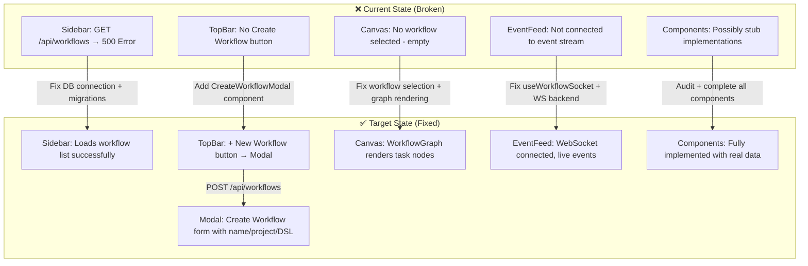
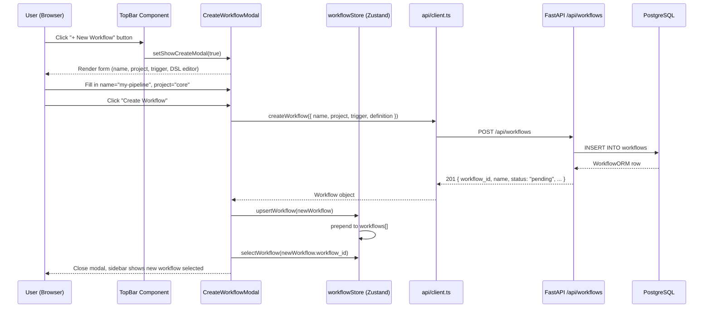
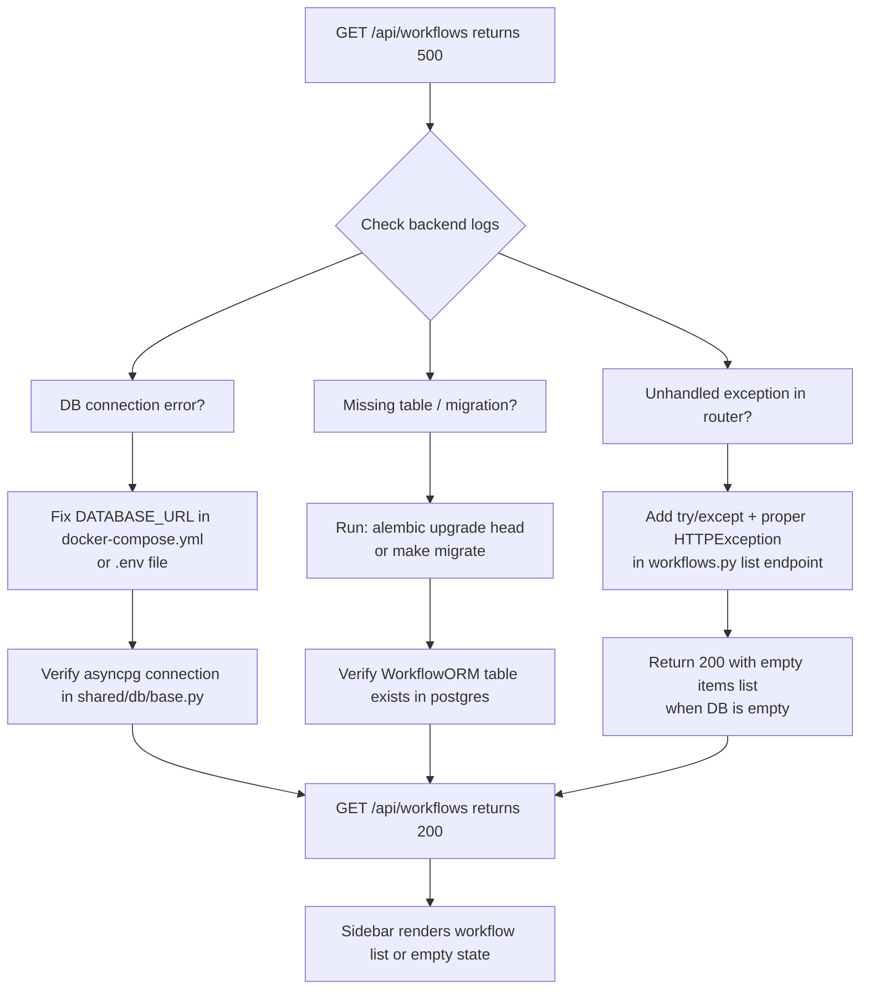
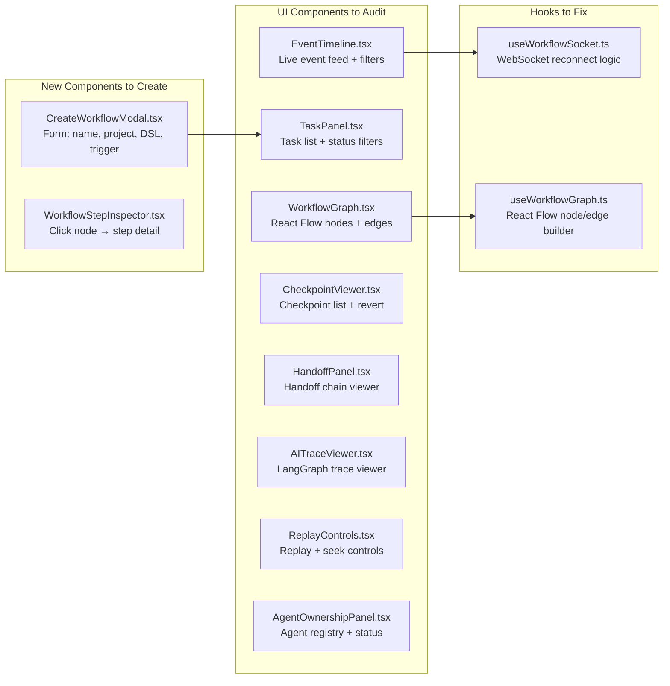

# FlowOS — Missing Features & Bug Fix Plan: Workflow Creation + Core UI Gaps

The FlowOS UI is running at `localhost:5173/canvas` but is broken in several critical ways: the sidebar shows a **500 error** when loading workflows, there is **no "Create Workflow" button or modal** anywhere in the app, the WebSocket event stream is **offline**, and several UI components are likely stubs. This plan identifies every gap between the original design and the current implementation, then fixes them in focused vertical slices.

---

## Design & Architecture

### Overview

The existing codebase has the full structural skeleton in place: FastAPI backend with routers for workflows/tasks/agents/checkpoints/handoffs/events, a React frontend with 8 component directories, a Zustand store, and an API client. However, the **workflow creation flow is entirely absent** from the UI — there is no button, no modal, no form, and no wiring to the `POST /api/workflows` endpoint that already exists in `api/client.ts` (`createWorkflow()`).

The 500 error on `GET /api/workflows` is a backend issue — most likely a database connection failure, a missing Alembic migration, or an unhandled exception in `workflows.py`. The WebSocket "Offline" status means the `useWorkflowSocket` hook is either not connecting or the backend WS endpoint is not running. The component directories under `ui/src/components/` each contain a single `.tsx` file — these need to be verified as fully implemented (not stubs).

The fix plan is organized as vertical feature slices: (1) fix the backend 500 error so the sidebar loads, (2) add the Create Workflow modal to the UI, (3) fix the WebSocket connection, (4) audit and complete all stub components, and (5) wire up the full end-to-end flow with seed data for testing.

### Diagrams

#### Diagram 1: Current State vs Target State



#### Diagram 2: Create Workflow Flow



#### Diagram 3: Backend 500 Error — Diagnosis & Fix Flow



#### Diagram 4: Component Completeness Audit



#### Diagram 5: CreateWorkflowModal UI Layout

```mermaid
graph TD
    subgraph Modal["CreateWorkflowModal — Dark Theme Dialog"]
        Header["Header: '+ New Workflow'  [X close]"]
        NameField["Input: Workflow Name* (required, min 1 char)"]
        ProjectField["Input: Project / Namespace (optional)"]
        TriggerSelect["Select: Trigger = API | CLI | SCHEDULE | WEBHOOK"]
        DSLSection["Collapsible: Workflow DSL (YAML textarea, optional)"]
        TagsField["Input: Tags (comma-separated, optional)"]
        Footer["Footer: [Cancel]  [Create Workflow →]"]
    end

    Header --> NameField
    NameField --> ProjectField
    ProjectField --> TriggerSelect
    TriggerSelect --> DSLSection
    DSLSection --> TagsField
    TagsField --> Footer
```



### Directory Structure

```
flowos/                                    # Python backend monorepo
├── api/
│   ├── main.py                           # FastAPI app — fix lifespan/startup errors
│   ├── routers/
│   │   └── workflows.py                  # Fix 500 on GET /workflows (empty DB case)
│   └── ws_server.py                      # Fix WebSocket broadcast manager
├── shared/
│   ├── config.py                         # Verify DATABASE_URL, KAFKA_BOOTSTRAP_SERVERS
│   └── db/
│       ├── base.py                       # Fix async engine connection
│       └── models.py                     # Verify WorkflowORM, TaskORM exist
│
ui/src/
├── App.tsx                               # Add "+ New Workflow" button to TopBar
├── api/
│   └── client.ts                         # createWorkflow() already exists ✓
├── store/
│   └── workflowStore.ts                  # Add createWorkflow action if missing
├── components/
│   ├── CreateWorkflowModal/              # NEW — full create workflow form
│   │   └── CreateWorkflowModal.tsx
│   ├── WorkflowGraph/
│   │   └── WorkflowGraph.tsx             # Audit: must render React Flow nodes
│   ├── TaskPanel/
│   │   └── TaskPanel.tsx                 # Audit: must fetch + display tasks
│   ├── EventTimeline/
│   │   └── EventTimeline.tsx             # Audit: must connect to WS events
│   ├── CheckpointViewer/
│   │   └── CheckpointViewer.tsx          # Audit: must fetch checkpoints
│   ├── HandoffPanel/
│   │   └── HandoffPanel.tsx              # Audit: must fetch handoffs
│   ├── AITraceViewer/
│   │   └── AITraceViewer.tsx             # Audit: must fetch reasoning runs
│   ├── ReplayControls/
│   │   └── ReplayControls.tsx            # Audit: must have replay controls
│   └── AgentOwnershipPanel/
│       └── AgentOwnershipPanel.tsx       # Audit: must fetch agents
└── hooks/
    ├── useWorkflowSocket.ts              # Fix: reconnect logic + WS URL
    └── useWorkflowGraph.ts               # Audit: builds React Flow graph
```

### Reference Material (Screenshot Analysis)

The attached screenshot shows the FlowOS UI running at `localhost:5173/canvas`. Here is an exhaustive description:

**Layout:** Three-column layout with a dark theme (near-black background `#0f1117`).

**Left Sidebar (width ~170px):**
- Header: "Workflows" label with a refresh icon (circular arrows) to the right
- Filter tabs below: "All" (selected/highlighted in purple), "Running", "Pending", "Done", "Failed"
- Content area: Shows an error state with a red circle/alert icon, red text reading **"Request failed with status code 500"**, and a small "Retry" button with a border
- This means `GET /api/workflows` is returning HTTP 500

**Center Canvas (main area, ~1050px wide):**
- Dark background, completely empty
- Center shows a git-branch-like icon (two circles connected by a curved line)
- Below icon: gray text "No workflow selected"
- Below that: smaller gray text "Select a workflow from the sidebar to view its task graph"
- No workflow graph nodes, no edges, nothing interactive

**Right Panel (width ~300px):**
- Tab bar at top with tabs: "Tasks" (selected, highlighted purple), "Checkpoints", "Handoffs", "AI Tr..." (truncated, likely "AI Trace")
- Below tabs: "Tasks" heading
- Sub-filter tabs: "All" (selected purple), "Running", "Pending", "Done", "Failed"
- Content area: Shows a 3D cube/box icon (gray) and text "Select a workflow to view tasks"
- No task data visible

**Bottom Event Feed Strip (height ~150px):**
- Header: lightning bolt icon + "Event Feed" label
- Right side of header: "0" count badge, "AUTO" green badge, trash/clear icon, "Offline" label in gray
- Filter tabs: "All" (selected), "Workflow", "Task", "Agent", "Build", "AI", "Policy"
- Content area: Shows a waveform/activity icon and text "Not connected to event stream"
- The WebSocket is not connected (status: Offline)

**Top Bar:**
- Left: Lightning bolt (Zap) icon + "FlowOS" text
- Center: "Select a workflow from the sidebar" placeholder text
- Right: "Relaunch to update" button (browser extension notification, not part of app)
- **CRITICAL MISSING ELEMENT:** There is NO "+ New Workflow" or "Create" button anywhere in the top bar or sidebar. This is the primary missing feature.

**Key observations:**
1. The sidebar 500 error prevents any workflow from loading
2. No workflow creation UI exists at all
3. WebSocket is offline — event feed non-functional
4. The right panel and canvas are in empty/placeholder states because no workflow is selected (which is impossible since the sidebar errors out)

### Key Design Decisions

| Decision | Choice | Rationale |
|----------|--------|-----------|
| Create Workflow button location | TopBar (right side, before WS dot) | Consistent with the existing action buttons (Pause/Resume/Cancel) already in TopBar |
| Modal vs page | Modal dialog | Keeps user in context, matches the dark-theme inline style of the app |
| DSL input | Collapsible YAML textarea | Optional for simple workflows; power users can paste DSL |
| 500 fix approach | Graceful degradation + proper error handling | Return empty list when DB is empty, not 500 |
| WS reconnect | Exponential backoff in useWorkflowSocket | Prevents hammering the server on disconnect |
| Seed data | Python script `examples/seed_data.py` | Allows immediate testing without manual API calls |

### Technology Stack

- **Frontend:** React 18 + TypeScript + Vite, Zustand, React Flow, Lucide React, Axios, date-fns
- **Backend:** Python 3.12, FastAPI, SQLAlchemy 2.0 async, PostgreSQL 16
- **Event Bus:** Apache Kafka (confluent-kafka), WebSocket (FastAPI)
- **Dev Environment:** Docker Compose, Makefile

---

## Execution Plan

### Phase 1: Fix Backend 500 Error on GET /workflows
**Estimated effort:** 1-2 hours
**Dependencies:** None

The sidebar shows "Request failed with status code 500" when calling `GET /api/workflows`. This is the most critical blocker — nothing in the UI works until this is fixed. The root cause is likely one of: (a) the PostgreSQL async engine failing to connect, (b) the `workflows` table not existing because migrations haven't run, or (c) an unhandled exception in the list endpoint when the DB is empty or Kafka is unavailable.

#### Tasks:
- [ ] Read `flowos/shared/db/base.py` fully — verify `create_async_engine()` uses `asyncpg` driver and the `DATABASE_URL` is correctly formatted (`postgresql+asyncpg://...`)
- [ ] Read `flowos/shared/db/models.py` — verify `WorkflowORM` table definition exists with all required columns (`workflow_id`, `name`, `status`, `trigger`, `owner_agent_id`, `project`, `inputs`, `tags`, `outputs`, `created_at`, `updated_at`, `completed_at`)
- [ ] Read `flowos/api/routers/workflows.py` lines 100-300 — find the `GET /workflows` list handler and identify the exact failure point (missing try/except, Kafka dependency failing, DB query error)
- [ ] Fix `flowos/api/routers/workflows.py`: wrap the list endpoint in a proper try/except, ensure Kafka producer failure does NOT cause a 500 (it's optional for reads), return `{"items": [], "total": 0, "limit": 50, "offset": 0}` when DB is empty
- [ ] Fix `flowos/api/main.py` lifespan: ensure Kafka producer init failure is caught and logged as WARNING (not ERROR that crashes startup), set `app.state.producer = None` on failure so routes degrade gracefully
- [ ] Fix `flowos/api/dependencies.py`: ensure `KafkaProducer` dependency returns `None` (not raises) when Kafka is unavailable, so read-only endpoints still work
- [ ] Verify `flowos/docker-compose.yml` has correct `DATABASE_URL` env var for the API service pointing to the postgres container
- [ ] Add `flowos/shared/db/migrations/` Alembic setup if missing: `alembic init`, configure `env.py` to use `WorkflowORM` metadata, create initial migration with `alembic revision --autogenerate -m "initial"`
- [ ] Add `make migrate` target to `Makefile` that runs `alembic upgrade head` inside the API container
- [ ] Test: `curl http://localhost:8000/api/workflows` should return `{"items":[],"total":0,"limit":50,"offset":0}` with HTTP 200

#### Deliverables:
- Fixed `flowos/api/routers/workflows.py` with graceful error handling
- Fixed `flowos/api/main.py` with non-fatal Kafka init
- Fixed `flowos/api/dependencies.py` with optional Kafka dependency
- Working `GET /api/workflows` returning 200 with empty list

---

### Phase 2: Create Workflow Modal — Full UI Feature
**Estimated effort:** 2-3 hours
**Dependencies:** Phase 1

Add the missing "Create Workflow" feature end-to-end: a `+ New Workflow` button in the TopBar that opens a fully functional modal form. The `createWorkflow()` function already exists in `ui/src/api/client.ts` — this phase wires it to a new UI component.

#### Tasks:
- [ ] Create `ui/src/components/CreateWorkflowModal/CreateWorkflowModal.tsx` as a fully implemented modal component:
  - Props: `isOpen: boolean`, `onClose: () => void`, `onCreated: (wf: Workflow) => void`
  - Form fields:
    - **Workflow Name** (required `<input>`, min 1 char, max 255, placeholder "e.g. feature-delivery-pipeline")
    - **Project** (optional `<input>`, placeholder "e.g. core-platform")
    - **Trigger** (`<select>`: options `api` | `cli` | `schedule` | `webhook`, default `api`)
    - **Tags** (optional `<input>`, comma-separated, placeholder "e.g. production, critical")
    - **Workflow DSL** (collapsible `<textarea>`, YAML, placeholder with example DSL from design doc)
  - Submit handler: calls `createWorkflow({ name, project, trigger, tags, definition })` from `api/client.ts`
  - Loading state: disable submit button + show `<Loader2>` spinner while request is in flight
  - Error state: show inline error message in red if API call fails (use `normaliseError()`)
  - Success: call `onCreated(workflow)`, close modal
  - Styling: dark theme matching App.tsx inline styles (`background: '#1a1d27'`, `border: '1px solid #2e3347'`), overlay backdrop with `rgba(0,0,0,0.6)`, centered dialog ~480px wide
  - Keyboard: `Escape` key closes modal, `Enter` in name field submits
  - Use `lucide-react` icons: `X` for close, `Plus` for submit button, `Loader2` for loading
- [ ] Modify `ui/src/App.tsx` — `TopBar` component:
  - Add `showCreateModal` state: `const [showCreateModal, setShowCreateModal] = useState(false)`
  - Add `+ New Workflow` button to the right side of TopBar (before the WS status dot), always visible regardless of selected workflow:
    ```tsx
    <button onClick={() => setShowCreateModal(true)} style={{ fontSize: 11, fontWeight: 600, padding: '4px 10px', borderRadius: 5, border: '1px solid rgba(99,102,241,0.4)', background: 'rgba(99,102,241,0.1)', color: '#818cf8', cursor: 'pointer', display: 'flex', alignItems: 'center', gap: 4 }}>
      <Plus size={12} /> New Workflow
    </button>
    ```
  - Import `Plus` from `lucide-react`
  - Import `CreateWorkflowModal` component
  - Render `<CreateWorkflowModal isOpen={showCreateModal} onClose={() => setShowCreateModal(false)} onCreated={handleWorkflowCreated} />`
  - Implement `handleWorkflowCreated(wf: Workflow)`: calls `upsertWorkflow(wf)` on the store then `selectWorkflow(wf.workflow_id)`
- [ ] Verify `ui/src/store/workflowStore.ts` has `upsertWorkflow` action — if missing, add it: inserts new workflow at front of `workflows[]` array or updates existing entry by `workflow_id`
- [ ] Add `CreateWorkflowModal` export to component directory (no barrel file needed — direct import)

#### Deliverables:
- `ui/src/components/CreateWorkflowModal/CreateWorkflowModal.tsx` — fully implemented modal
- Updated `ui/src/App.tsx` with `+ New Workflow` button in TopBar
- Updated `ui/src/store/workflowStore.ts` with `upsertWorkflow` if missing

---

### Phase 3: Fix WebSocket Connection (Event Feed "Offline")
**Estimated effort:** 1-2 hours
**Dependencies:** None (parallel with Phase 2)

The Event Feed shows "Not connected to event stream" and "Offline". The `useWorkflowSocket` hook exists but is either connecting to the wrong URL, not handling reconnection, or the backend WebSocket endpoint is broken.

#### Tasks:
- [ ] Read `ui/src/hooks/useWorkflowSocket.ts` fully — identify the WebSocket URL construction, connection logic, and message handling
- [ ] Fix WebSocket URL: should be `ws://localhost:8000/ws` in dev (or use `VITE_WS_URL` env var). In Vite dev, WebSocket cannot be proxied the same way as HTTP — the URL must be absolute `ws://localhost:8000/ws` not `/ws`
- [ ] Add exponential backoff reconnect: on `ws.onclose`, schedule reconnect with `setTimeout` starting at 1s, doubling up to 30s max, reset on successful connection
- [ ] Update `useWorkflowStore` `wsStatus` to reflect: `'connecting' | 'connected' | 'disconnected' | 'error'`
- [ ] Read `flowos/api/ws_server.py` — verify the WebSocket endpoint is registered at `/ws` and the broadcast manager is working
- [ ] Fix `flowos/api/ws_server.py` if needed: ensure `@app.websocket("/ws")` handler is registered in `main.py`, the `BroadcastManager` starts its Kafka consumer background thread on app startup, and sends JSON-serializable messages
- [ ] Fix `flowos/api/main.py` lifespan: ensure `BroadcastManager.start()` is called during startup and `BroadcastManager.stop()` during shutdown
- [ ] Add `VITE_WS_URL=ws://localhost:8000` to `ui/.env.local` (create if missing) and update `useWorkflowSocket.ts` to read `import.meta.env.VITE_WS_URL`
- [ ] Test: open browser DevTools → Network → WS tab, verify connection to `ws://localhost:8000/ws` shows status 101 Switching Protocols

#### Deliverables:
- Fixed `ui/src/hooks/useWorkflowSocket.ts` with correct URL + reconnect logic
- Fixed `flowos/api/ws_server.py` with working broadcast manager
- Fixed `flowos/api/main.py` with WS startup/shutdown
- `ui/.env.local` with `VITE_WS_URL`

---

### Phase 4: Audit & Complete All UI Components
**Estimated effort:** 3-4 hours
**Dependencies:** Phase 1

Each component directory has a `.tsx` file. Read each one and complete any stub implementations. A stub is any component that renders a placeholder ("Select a workflow to view tasks") without actually fetching data from the API.

#### Tasks:
- [ ] **WorkflowGraph/WorkflowGraph.tsx** — Read fully. Must:
  - Use `useWorkflowStore` to get `selectedWorkflowId`
  - Call `listWorkflowTasks(workflowId)` from `api/client.ts` when a workflow is selected
  - Build React Flow nodes from tasks: each task = a node with `id=task.task_id`, `data={label, status, type, assigned_to}`, position calculated from `dependencies` array (topological sort for y-axis, task index for x-axis)
  - Build React Flow edges from `task.dependencies[]`
  - Render `<ReactFlow nodes={nodes} edges={edges} fitView />` with custom node colors by status (pending=gray, running=amber, completed=green, failed=red)
  - If stub: implement fully with the above logic
- [ ] **TaskPanel/TaskPanel.tsx** — Read fully. Must:
  - Fetch tasks for selected workflow via `listWorkflowTasks(workflowId)`
  - Show status filter tabs (All/Running/Pending/Done/Failed) matching the design in the screenshot
  - Render each task as a card: task name, type badge (human/machine/ai), status badge, assigned_to, created_at relative time
  - Show empty state "Select a workflow to view tasks" when no workflow selected
  - If stub: implement fully
- [ ] **EventTimeline/EventTimeline.tsx** — Read fully. Must:
  - Subscribe to `useWorkflowStore` for `events[]` (populated by WebSocket)
  - Show filter tabs: All / Workflow / Task / Agent / Build / AI / Policy (matching screenshot)
  - Show event count badge and AUTO/MANUAL toggle
  - Render each event as a row: timestamp, event type badge (color-coded), source agent, payload summary
  - Show "Not connected to event stream" when `wsStatus !== 'connected'`
  - If stub: implement fully
- [ ] **CheckpointViewer/CheckpointViewer.tsx** — Read fully. Must:
  - Fetch checkpoints via `GET /api/checkpoints?workflow_id=...` (add to `api/client.ts` if missing)
  - Render checkpoint list: label, commit hash (7 chars), branch, timestamp, agent
  - Show "Revert to this checkpoint" button per item
  - If stub: implement fully
- [ ] **HandoffPanel/HandoffPanel.tsx** — Read fully. Must:
  - Fetch handoffs via `GET /api/handoffs?workflow_id=...` (add to `api/client.ts` if missing)
  - Render handoff chain: from_agent → to_agent, summary, open_issues, timestamp
  - If stub: implement fully
- [ ] **AITraceViewer/AITraceViewer.tsx** — Read fully. Must:
  - Fetch reasoning runs (add `GET /api/reasoning-runs?task_id=...` to `api/client.ts` if endpoint exists, else show placeholder with correct empty state)
  - Render: framework badge (langgraph/langchain), graph_name, status, inputs/outputs summary
  - If stub: implement fully
- [ ] **ReplayControls/ReplayControls.tsx** — Read fully. Must:
  - Show replay controls: Play/Pause, speed selector (0.5x/1x/2x/5x), seek slider
  - Fetch events for selected workflow and replay them in order
  - If stub: implement with functional replay using stored events from workflowStore
- [ ] **AgentOwnershipPanel/AgentOwnershipPanel.tsx** — Read fully. Must:
  - Fetch agents via `listAgents()` from `api/client.ts`
  - Render agent cards: name, type badge (human/machine/ai), status dot, current_task_id, capabilities
  - If stub: implement fully
- [ ] Add missing API client functions to `ui/src/api/client.ts` if needed:
  - `listCheckpoints(params)` → `GET /api/checkpoints`
  - `listHandoffs(params)` → `GET /api/handoffs`
  - `listWorkflowCheckpoints(workflowId)` → `GET /api/workflows/{id}/checkpoints`
  - `listWorkflowHandoffs(workflowId)` → `GET /api/workflows/{id}/handoffs`

#### Deliverables:
- All 8 component `.tsx` files fully implemented (not stubs)
- Updated `ui/src/api/client.ts` with any missing endpoint functions

---

### Phase 5: Seed Data & Backend Smoke Test
**Estimated effort:** 1-2 hours
**Dependencies:** Phase 1

Create a seed data script and verify the full stack works end-to-end: create a workflow via API, see it in the sidebar, click it, see the graph, see tasks in the right panel.

#### Tasks:
- [ ] Create `flowos/examples/seed_data.py` — a standalone Python script that:
  - Uses `httpx` (or `requests`) to call the local API
  - Creates 3 sample workflows via `POST /api/workflows`:
    1. `feature_delivery_pipeline` (status: running, project: core-platform)
    2. `build_and_review` (status: completed, project: infra)
    3. `hotfix_deploy` (status: pending, project: core-platform)
  - Creates tasks for each workflow via `POST /api/tasks` (if endpoint exists) or directly via DB insert
  - Creates sample agents via `POST /api/agents`
  - Prints summary of created resources
- [ ] Add `make seed` target to `Makefile`: `python examples/seed_data.py`
- [ ] Verify `GET /api/workflows` returns the 3 seeded workflows
- [ ] Verify `GET /api/workflows/{id}/tasks` returns tasks for a workflow
- [ ] Verify `GET /api/agents` returns the seeded agents
- [ ] Check `flowos/api/routers/checkpoints.py` — verify `GET /checkpoints` endpoint exists and works
- [ ] Check `flowos/api/routers/handoffs.py` — verify `GET /handoffs` endpoint exists and works
- [ ] Fix any additional 500 errors discovered during smoke testing in the routers

#### Deliverables:
- `flowos/examples/seed_data.py` with 3 workflows + tasks + agents
- Updated `Makefile` with `make seed` target
- All API endpoints returning 200 for seeded data

---

### Phase 6: WorkflowStore Completeness & Zustand Wiring
**Estimated effort:** 1 hour
**Dependencies:** Phase 1, Phase 2

Ensure the Zustand store has all the state slices needed by the components added/fixed in Phases 2-4.

#### Tasks:
- [ ] Read `ui/src/store/workflowStore.ts` fully — audit all state slices and actions
- [ ] Ensure the following state exists (add if missing):
  - `workflows: Workflow[]` + `workflowsLoading: boolean` + `workflowsError: string | null` + `workflowsTotal: number`
  - `selectedWorkflowId: string | null` + `selectedWorkflow: Workflow | null` (derived)
  - `tasks: Task[]` + `tasksLoading: boolean` + `tasksError: string | null`
  - `events: FlowEvent[]` (capped at last 500 events)
  - `wsStatus: 'connecting' | 'connected' | 'disconnected' | 'error'`
  - `checkpoints: Checkpoint[]` + `checkpointsLoading: boolean`
  - `handoffs: Handoff[]` + `handoffsLoading: boolean`
  - `agents: Agent[]` + `agentsLoading: boolean`
- [ ] Ensure the following actions exist (add if missing):
  - `setWorkflows(items, total)` — replaces workflow list
  - `upsertWorkflow(wf)` — insert at front or update by workflow_id
  - `selectWorkflow(id | null)` — sets selectedWorkflowId, clears tasks/checkpoints/handoffs
  - `setTasks(items)` — replaces task list for selected workflow
  - `addEvent(event)` — prepends to events[], trims to 500
  - `setWsStatus(status)` — updates WebSocket connection status
  - `setCheckpoints(items)` — replaces checkpoint list
  - `setHandoffs(items)` — replaces handoff list
  - `setAgents(items)` — replaces agent list
- [ ] Add TypeScript interfaces if missing: `Checkpoint`, `Handoff`, `Agent` (may already be in `api/client.ts` — re-export from store or import from client)

#### Deliverables:
- Fully audited and completed `ui/src/store/workflowStore.ts`

---

### Verification Criteria

After all phases are complete, verify the following:

**Backend API (curl tests):**
```bash
# Should return 200 with items array (empty or seeded)
curl http://localhost:8000/api/workflows
# Expected: {"items":[...],"total":N,"limit":50,"offset":0}

# Should return 200 after seed
curl http://localhost:8000/api/workflows | python3 -m json.tool | grep '"total"'
# Expected: "total": 3

# Health check
curl http://localhost:8000/api/health
# Expected: {"status":"ok"}

# Create workflow via API
curl -X POST http://localhost:8000/api/workflows \
  -H "Content-Type: application/json" \
  -d '{"name":"test-workflow","project":"test","trigger":"api"}'
# Expected: 201 with workflow_id, status="pending"
```

**Frontend UI (manual verification at localhost:5173/canvas):**
1. **Sidebar loads** — no "Request failed with status code 500" error; shows workflow list or "No workflows found" empty state
2. **"+ New Workflow" button** — visible in the TopBar, right side, before the WS status dot
3. **Create Workflow modal** — clicking "+ New Workflow" opens a dark-themed modal with Name, Project, Trigger, Tags, DSL fields
4. **Create workflow flow** — fill in name "test-pipeline", click "Create Workflow", modal closes, new workflow appears in sidebar selected
5. **Workflow graph** — selecting a workflow shows task nodes in the canvas (or "No tasks" if empty)
6. **Event Feed** — shows "Connected" status (green dot), not "Offline"
7. **Right panel tabs** — Tasks, Checkpoints, Handoffs, AI Trace, Agents, Replay all render content (not blank stubs)
8. **WebSocket** — browser DevTools → Network → WS shows active connection to `ws://localhost:8000/ws`

**End-to-end smoke test:**
```bash
# 1. Start services
cd flowos && make up

# 2. Run migrations
make migrate

# 3. Seed data
make seed

# 4. Start UI
cd ../ui && npm run dev

# 5. Open http://localhost:5173/canvas
# 6. Verify sidebar shows 3 workflows (feature_delivery_pipeline, build_and_review, hotfix_deploy)
# 7. Click "feature_delivery_pipeline" — canvas shows task graph
# 8. Click "+ New Workflow" — modal opens
# 9. Create "my-test-workflow" — appears in sidebar
```
